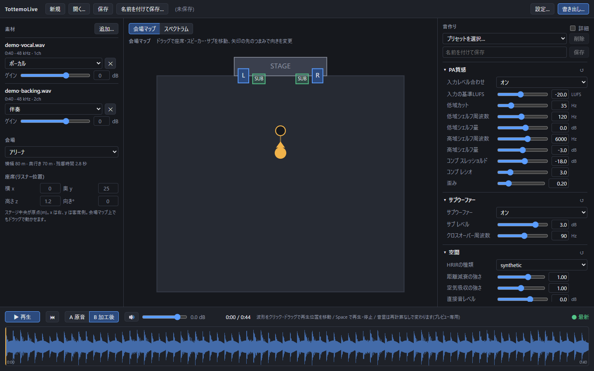
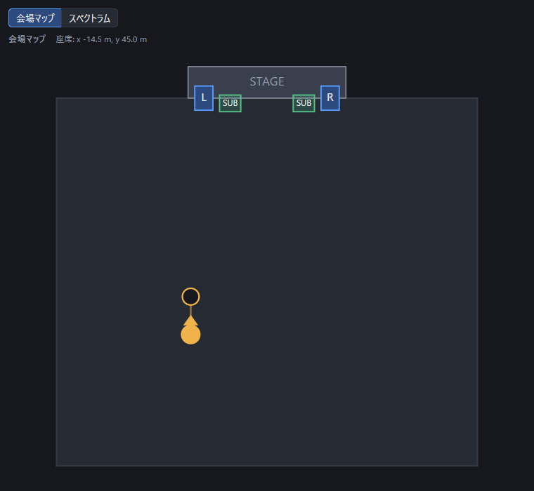
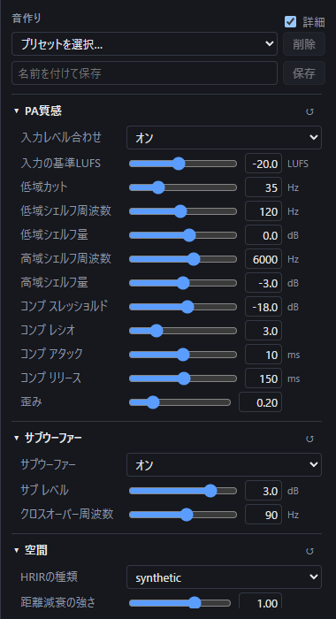
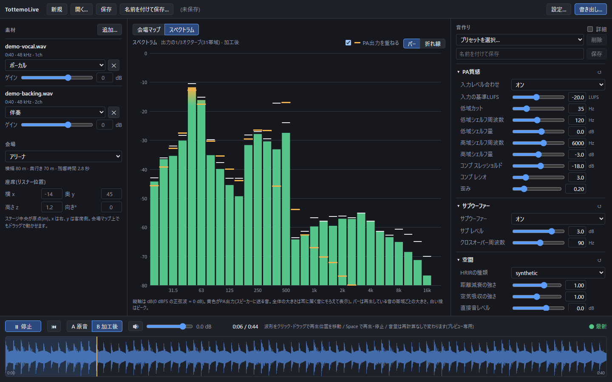
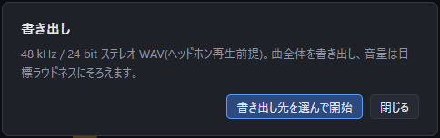
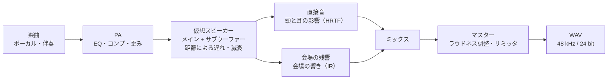

# TottemoLive

好きな楽曲を、ライブ会場の指定した座席で聴いているような音に変換するデスクトップアプリです。
会場の広さや響き、PAスピーカーとの距離・方向をシミュレーションし、ヘッドホンで聴くためのバイノーラル音源（48 kHz／24 bitのWAV）として書き出します。
Windows x64、Intel Mac、Apple Silicon Mac向けの配布ビルドを用意しています。

## できること

スタジオで仕上げられた楽曲は、耳元で鳴っているように聞こえます。
ライブ会場では、同じ曲がPAスピーカーを通り、離れた場所から届き、会場の響きをまとって聞こえます。
TottemoLiveは、その「会場で聴く音」を、曲と座席を選ぶだけで作ります。

- アリーナの後方席、ライブハウスの最前列など、会場と座席を変えて聴き比べられます
- PAの音の質感、サブウーファーの量、残響の長さなど、音に関わる値はすべて画面から調整できます
- 調整しながら曲全体を試聴し、原音との聴き比べ（A/B）もできます
- できあがった音は、ヘッドホンで聴くためのWAVファイルとして書き出せます

## 主な機能

| 機能 | 内容 |
| --- | --- |
| 素材の読み込み | WAV／FLAC／MP3／M4Aをドラッグ&ドロップまたはファイル選択で追加。ボーカルと伴奏の2本（推奨）でも、2mix 1本でも使えます。素材ごとに役割とゲインを設定 |
| 会場プリセット | クラブ／ライブハウス／ホール／アリーナ／野外フェス／ドーム。会場ごとに広さ・残響時間・スピーカーの既定位置が変わります |
| 会場マップ | 会場を上から見た図で、座席（リスナー）・メインスピーカー・サブウーファーをドラッグで動かし、聴く向きも変えられます。座標を数値で入力することもできます |
| 音作りパネル | PAの質感（低域カット・シェルフEQ・コンプ・歪み）、サブウーファー（レベル・クロスオーバー）、空間（距離減衰・空気吸収・直接音のレベル）、残響（量・長さ・高域／低域の響き方）、マスター（ラウドネス目標・ピーク上限）。変更した項目には印が付き、ダブルクリックで既定値に戻せます |
| 音作りプリセット | 出荷時のプリセット（標準・クリア・こもったPA・ホール向き・最前列・後方席）に加え、自分の設定を名前を付けて保存できます。素材と座席は含まないので、別の曲にもそのまま使えます |
| プレビュー | 値を変えると、書き出しと同じ処理で曲全体を作り直し、再生位置を保ったまま差し替えます。長い曲では、再生位置の周辺約30秒を先に作る「先行プレビュー」で、待たずに聴き始められます |
| A/B比較 | 原音（A）と加工後（B）を切り替えて聴き比べられます。どちらも同じラウドネスにそろえてあります |
| スペクトラム | 再生中の音を1/3オクターブ（31帯域）のバーまたは折れ線で表示。スピーカーに送る音（PA出力）を重ねて、会場・座席による音色の変化を見比べられます |
| 書き出し | 48 kHz／24 bitのステレオWAV。曲全体のラウドネスを目標値にそろえ、トゥルーピークリミッタで仕上げます |
| ステム分離（任意） | [Demucs](https://github.com/facebookresearch/demucs)を別途導入すると、2mixの音源をボーカルと伴奏に分けて使えます |
| プロジェクトの保存 | 素材・会場・座席・音作りの設定を1つのファイルに保存して、後から開き直せます（音源ファイルはコピーせず、場所を記録します） |

## 使い方

### 1. 曲を追加する

左の「素材」に音源ファイルをドラッグ&ドロップするか、「追加…」から選びます。
素材ごとに役割（ボーカル／伴奏／2mix）とゲインを設定します。

### 2. 会場と座席を選ぶ

「会場」のプリセットを選び、中央の会場マップで座席（オレンジの印）をドラッグします。
ステージに近づくほど直接の音が大きくはっきりし、離れるほど会場の響きが増えます。
スピーカー（L／R）とサブウーファー（SUB）も動かせます。矢印の先のつまみで、聴く向きを変えられます。

### 3. 音を調整して試聴する

右の「音作り」パネルで値を動かすと、プレビューが自動で作り直されます。
下の再生ボタン（またはSpaceキー）で再生し、「A 原音」「B 加工後」で聴き比べます。
波形をクリック・ドラッグすると、再生位置を移動できます。
音作りプリセットを選ぶと、まとまった設定を一度に試せます。「詳細」にチェックを入れると、細かい項目も表示されます。

中央を「スペクトラム」に切り替えると、再生中の音の帯域ごとの大きさを確認できます。
黄色の印はスピーカーに送る音（PA出力）で、座席までの距離や会場の響きによる音色の変化が分かります。

### 4. 書き出す

右上の「書き出し…」から保存先を選ぶと、曲全体を書き出します。進捗が表示され、途中で中断することもできます。

書き出したファイルは、ヘッドホンで聴いてください。左右の耳に届く音を個別に計算しているため、ヘッドホンでの再生を前提にしています。

## 仕組み

TottemoLiveは、ライブ会場で音が耳に届くまでの流れを、順に計算で再現します。

1. **PA**：会場のスピーカーから鳴らす前の音作りです。EQ（音色の調整）、コンプ（音量差を縮める処理）、軽い歪みで「スピーカー越し」の質感を付けます
2. **仮想スピーカー**：ステージ脇のメインスピーカーと床のサブウーファーを置き、座席までの距離から、音が届くまでの遅れ・距離による音量の減衰・空気による高域の減衰を計算します
3. **直接音**：スピーカーから耳へまっすぐ届く音です。音の来る方向に応じて、左右の耳での聞こえ方の違い（HRTF：頭部伝達関数。その時間波形がHRIR）を付けます
4. **会場の残響**：壁や天井で反射を繰り返して届く響きです。会場ごとの響き（IR：インパルス応答）を畳み込みで付けます。残響の量は会場の大きさと響きの長さから物理的に決まり、ステージから離れた席ほど響きの割合が増えます
5. **ミックスとマスター**：直接音と残響を合わせ、曲全体の音量（ラウドネス）を目標値にそろえ、ピークが上限を超えないように仕上げます

プレビューは、書き出しと同じ処理を曲全体に対して行うので、試聴した音と書き出した音は同じになります。

## 動作環境と導入

| 項目 | 内容 |
| --- | --- |
| 対応OS | Windows 10／11（x64）、Intel Mac、Apple Silicon Mac |
| 必須 | [FFmpeg](https://ffmpeg.org/)（ffmpegとffprobe）。音源の読み込みと書き出しに使います。アプリには同梱していないので、別途インストールしてください |
| 任意 | Demucs（ステム分離を使う場合だけ） |
| 推奨 | ヘッドホン |

GitHub ReleasesのAssetsから、対象OSのZIPを取得して展開します。
WindowsではWebView2 Runtimeも必要です（導入済みなら不要）。
配布物は署名・公証をしていないため、初回起動時にOSの確認が表示されることがあります。
手順の詳細、FFmpeg／Demucsの場所の指定、チェックサムの確認は[インストール手順](docs/INSTALL.md)を参照してください。

## 現状の制限と注意

- **頭部伝達関数（HRIR）と会場の響き（IR）は、現状は計算で作った合成のもの**です。実測データは再配布条件の確認が済むまで同梱していません。合成のHRIRは耳介の効果を持たないため、上下・前後の定位は弱めです。合成の会場IRは初期反射を持ちません。実測データへの差し替えを含め、音質は引き続き改善していきます
- 次の機能は初版の対象外です：リアルタイム処理（再生しながらの変換）、ヘッドトラッキング、動画との合成
- 体で感じる低音の圧力そのものは再現できません。耳に届く音で、近い印象を作ります
- プレビューを速くするため、処理の途中結果をディスクに一時保存します。曲の長さ1分あたり約70MB、長い曲では数GBを使います。使う・使わないと置き場所は、ヘッダーの「設定…」から変えられます（[詳細](docs/INSTALL.md#ディスクキャッシュ一時ファイル)）
- ステム分離（Demucs）は重い処理で、初回はモデルのダウンロードも発生します
- 変換した音源を公開する場合は、原曲の利用条件に従ってください

## ドキュメント

| ドキュメント | 内容 |
| --- | --- |
| [インストール手順](docs/INSTALL.md) | 配布物の導入、FFmpeg／Demucsの設定、ディスクキャッシュ、チェックサム |
| [開発者向けガイド](docs/DEVELOPMENT.md) | 開発環境、ビルド・テストのコマンド、アーキテクチャ、ディレクトリ構成、CI/CDとリリース手順 |
| [設計書](TottemoLive-design.md) | 信号処理・プレビュー・データモデルなどの詳細な設計 |

## 使用しているソフトウェア

- デスクトップアプリの枠組みに[Wails](https://wails.io/)、画面に[Svelte](https://svelte.dev/)、FFTに[gonum](https://www.gonum.org/)を使っています
- 音源の読み込みと書き出しには、利用者が別途インストールした[FFmpeg](https://ffmpeg.org/)を子プロセスとして呼び出します。FFmpegはアプリに同梱していません
- ステム分離には、利用者が別途インストールした[Demucs](https://github.com/facebookresearch/demucs)を子プロセスとして呼び出します
