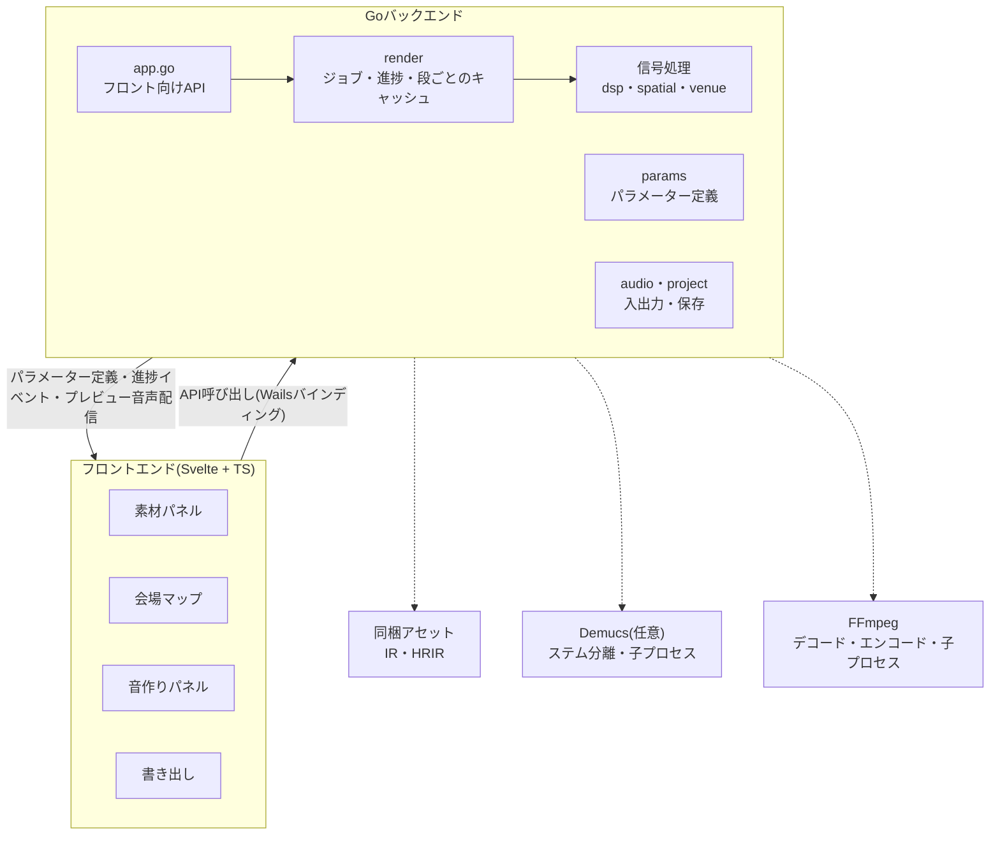
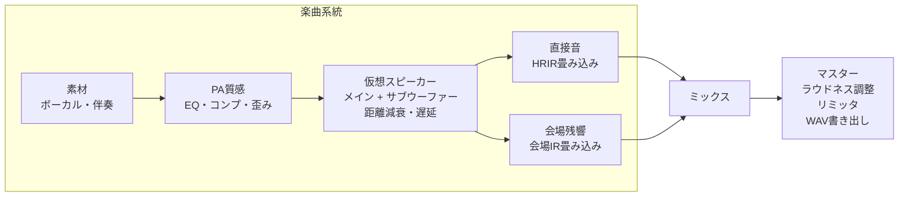

# ライブ風バイノーラル変換ツール 設計書(Go + Wails)

2026-10-09

## 概要とゴール

楽曲音源を読み込み、指定した会場と座席で聴いているようなバイノーラル音源を書き出すデスクトップアプリ。信号処理と書き出しはGoで行い、UIはWails上のフロントエンド(Svelte + TypeScript想定)で組む。

- 入力: WAV / FLAC / MP3 / M4A(AAC)。ボーカルと伴奏のステム推奨、2mixのみも可
- 処理: PA質感付け → 仮想スピーカー配置 → 会場残響 → バイノーラル化
- 音作り: 上記の各段のパラメーターをすべてUIから調整でき、曲全体のプレビューで聴きながら詰められる
- 出力: 48kHz / 24bit ステレオWAV(ヘッドホン再生前提)
- 初版の対象外: リアルタイム処理、ヘッドトラッキング、動画との合成

## 全体アーキテクチャ

フロントは表示と操作だけを担当し、デコードから書き出しまでの処理はすべてGo側のrenderジョブが実行する。音作りパラメーターの定義(範囲・既定値・表示名)もGo側が持ち、フロントはその定義から調整UIを自動生成する。



FFmpegとDemucsは子プロセスとして呼ぶので、GoのビルドにcgoやPythonを持ち込まずに済む。

## 信号処理パイプライン

楽曲は「PA → 仮想スピーカー(メイン + サブウーファー) → 直接音と残響」の1系統で処理し、最後に1本にまとめる。



- PA質感: まず、音源ゲイン後の合計の統合ラウドネスを `pa.inputLufs`(既定 -20 LUFS)にそろえる共通ゲインを掛ける(`pa.autoLevel`。コンプと歪みは入力の絶対レベルで効くので、曲のマスターの音量に依らず同じ設定が同じように効くようにする。全音源に共通なので音量バランスは変わらない)。そのうえで、低域カット、低域シェルフ(既定は 0 dB。下げて締めることも、上げて厚みを足すこともできる -12〜+9 dB)、高域シェルフ(既定は少し丸める -3 dB。持ち上げて抜けを足すこともできる +6 dB まで)、軽いコンプと歪みで「スピーカー越し」の音にする
- サブウーファー: ステージ前の床の左右に2発置く(会場プリセットごとの既定位置、会場マップで移動可)。PA出力を4次Linkwitz-Riley(`sub.crossoverHz`、既定90 Hz)で分け、メインには中高域だけを送り、低域は左右の合計(モノ)をサブの台数で割って、サブごとに距離減衰と遅延を掛けて両耳に同じ信号として足す(低域は方向の手がかりが弱いのでHRIRも空気吸収も通さない)。サブとメインの時間合わせは、現場のディレイ補正と同じく基準点(客席の中央・奥行きの半分・耳の高さ。現場のFOH)で1回だけ決める: 基準点で、サブの音がメインの平均距離の音と同時に届くよう、サブのほうが近いぶんだけサブを遅らせる(遠いサブは遅らせない)。リスナーまでの伝搬遅延はこれに足すだけなので、基準点から離れた席では、サブとメインの時間差や左右のサブの到着時刻の食い違い(サブ同士の干渉)が実際のように出る。左右の合計にするのは、中央の低音がメイン2本でコヒーレントに足される大きさ(+6 dB)に合わせるためで、`sub.levelDb` 0 がメインの低域と同じ大きさになる。残響は、スピーカーから実際に放射された音(メインの高域 + サブの低域)で駆動する。会場の残響は、サブを含むスピーカーが放射した音が部屋を励起して生まれるので、サブのレベルを上げれば残響の低域もその分増え、低域カットやクロスオーバーも残響に反映される。残響の入力は、メインの高域(クロスオーバーより上)の左右平均 + サブの低域(左右の合計のクロスオーバーより下 × `sub.levelDb` の半分)で、サブ 0 dB のとき、サブをオフにしたときと同じ大きさになる(`radiatedMono`)。サブが無効なら左右平均(サブ分割をしない)。サブが無効のあいだは、サブの設定と位置は直接音にも残響にも影響せず、再計算もされない
- 仮想スピーカー: 左右のメインPAを置き、リスナーまでの距離から遅延・減衰・高域の空気吸収を計算する。左スピーカーに左ch、右スピーカーに右chを入力する。距離減衰は基準距離10 mでゲイン1、近いと大きく(逆距離則、上限+12 dB)、遠いと小さくなる。空気吸収はISO 9613-1(20 ℃・相対湿度50 %)の吸収係数 α(f)(8 kHzで約0.08 dB/m)に基づき、距離 × α(f) × `spatial.airAbsorption`(物理値に対する倍率)だけ高域を落とす線形位相FIRで掛ける(距離ごとの小さなFIRなので、HRIRと先に畳み込んで1回の畳み込みにし、FIRの群遅延は伝搬遅延から引いて到着時刻を変えない)
- 直接音: スピーカーごとに方向に合うHRIRを畳み込む。HRIRは合成(`synthetic`)と Brown–Duda の球形頭部モデル(`brown-duda`)から選べる。頭の影(反対側の耳の高域の遮り)の強さは `spatial.headShadow` で調整できる(両方のHRIRに効く)
- 会場残響: 会場IRにプリディレイ・減衰の伸縮・高域ダンプ・高域の減衰を掛けてから畳み込む。低域(境界周波数以下)は中高域と別に合成し、左右の相関・残響の長さ・レベルを調整できる(下の「低域の残響」)
- ミックス: 直接音・残響の2本をそれぞれのレベルで足す。直接音は `directLevelDb` だけ(距離による大きさは、スピーカーごとの距離減衰で既に掛かっている)。残響は会場の物理的な値を基準にする(下の「残響のレベルと距離」)。残響は、リスナーに最初の音が届く時刻(いちばん近いメインスピーカーの直接音の到着)から始まり、プリディレイはそこからの遅れになる(出力の長さは、その遅延ぶん伸びる)
- マスター: ラウドネスを目標値に合わせ、トゥルーピークリミッタで仕上げる。曲全体のラウドネスを先に測る必要があるので、ミックスは一時ファイルに置き、測り終えてからゲインとリミッタを掛けて書き出す(下記「流し処理」)。リミッタは、粗い推定(4倍・位相あたり16タップ)で全サンプルを見て、上限の6割以上のサンプルだけ精密な推定(8倍・48タップ)でも確かめる2段で(精密な推定を全サンプルに使うと約3.7倍遅い)、信号の端でも上限を守る(移動平均の範囲外は端のゲインで埋める)。帯域いっぱいのノイズでも上限を超える量は約0.8 dB以内

各段が読むパラメーターは「音作りパラメーター」節の表にまとめる。

## 音作りパラメーター

音に関わる数値はコードに固定値で埋めず、すべてパラメーターとして定義し、UIから調整できるようにする。

### パラメーター定義(`internal/params`)

パラメーターの一覧を`internal/params`に1つの表として持つ。これがUI・CLI・値の検証・既定値の共通の元になる。

```go
type ParamSpec struct {
    Path     string   // Project内の位置。例 "pa.lowCutHz"
    Label    string   // UIの表示名
    Group    string   // pa / sub / spatial / reverb / master
    Kind     string   // "float" / "int" / "enum"
    Unit     string   // "Hz" "dB" "ms" など
    Min, Max float64
    Step     float64
    Default  float64
    Scale    string   // "linear" / "log"(周波数や時間はlog)
    Options  []string // enumの選択肢
    Advanced bool     // trueなら「詳細」を開いたときだけ表示
}
```

- フロントは`ListParams()`で表を受け取り、スライダーや選択肢を自動生成する。パラメーターを足すときはGoの構造体にフィールドを足し、表に1行足すだけで、画面側のコードは変えない
- `Path`での値の読み書きは、Go側はjsonタグを使ったリフレクション、フロント側はパスを`.`で分割して行う
- `LoadProject`とレンダリング開始時に、Go側で全パラメーターを`Min`〜`Max`に丸める(プロジェクトファイルの手編集や古いプリセットへの備え)
- 表のすべての`Path`がProjectのフィールドに解決できることをテストで確認する

### パラメーター一覧

範囲と既定値は出発点で、M2で実際に聴きながら見直す。残響の既定値は会場プリセットごとに違う値を持つ。

| グループ | Path | 表示名 | 範囲 | 既定値 | 読む段 |
| --- | --- | --- | --- | --- | --- |
| PA質感 | `pa.autoLevel` | 入力レベル合わせ(PA入力のレベルをそろえる) | off / on | on | PA |
| | `pa.inputLufs` | 入力の基準LUFS(PA入力の基準ラウドネス) | -30〜-8 LUFS | -20 | PA |
| | `pa.lowCutHz` | 低域カット | 20〜200 Hz | 35 | PA |
| | `pa.lowShelfHz` | 低域シェルフ周波数 | 40〜400 Hz | 120 | PA |
| | `pa.lowShelfDb` | 低域シェルフ量 | -12〜+9 dB | 0 | PA |
| | `pa.highShelfHz` | 高域シェルフ周波数 | 2000〜12000 Hz | 6000 | PA |
| | `pa.highShelfDb` | 高域シェルフ量 | -12〜+6 dB | -3 | PA |
| | `pa.compThresholdDb` | コンプ スレッショルド | -40〜0 dB | -18 | PA |
| | `pa.compRatio` | コンプ レシオ | 1〜10 | 3 | PA |
| | `pa.compAttackMs` | コンプ アタック(詳細) | 1〜100 ms | 10 | PA |
| | `pa.compReleaseMs` | コンプ リリース(詳細) | 20〜1000 ms | 150 | PA |
| | `pa.drive` | 歪み | 0〜1 | 0.2 | PA |
| サブウーファー | `sub.enabled` | サブウーファー | off / on | on | 直接音・会場残響 |
| | `sub.levelDb` | サブ レベル | -30〜+12 dB | +3 | 直接音・会場残響 |
| | `sub.crossoverHz` | クロスオーバー周波数 | 50〜150 Hz | 90 | 直接音・会場残響 |
| 空間 | `spatial.hrirSet` | HRIRの種類 | synthetic / brown-duda | synthetic | 直接音 |
| | `spatial.headShadow` | 頭の影の強さ(1でモデルの値、0で影なし=時間差だけ。両方のHRIRに効く) | 0〜1.5 | 1.0 | 直接音 |
| | `spatial.distanceRolloff` | 距離減衰の強さ | 0〜1.5(1で逆距離則) | 1.0 | 仮想スピーカー |
| | `spatial.airAbsorption` | 空気吸収の強さ | 0〜2(1でISO 9613-1の物理値) | 1.0 | 仮想スピーカー |
| | `spatial.directLevelDb` | 直接音レベル | -12〜+6 dB | 0 | ミックス |
| 残響 | `reverb.mix` | 残響量(会場の物理的な値への補正。0.35で物理値、0で無し、1で約+9 dB) | 0〜1 | 0.35 | ミックス |
| | `reverb.preDelayMs` | プリディレイ | 0〜150 ms | 会場ごと | 会場残響 |
| | `reverb.decayScale` | 残響の長さ | 0.5〜1.2倍 | 1.0 | 会場残響 |
| | `reverb.highDampHz` | 残響の高域ダンプ | 2000〜16000 Hz | 会場ごと | 会場残響 |
| | `reverb.highDecayScale` | 高域の残響の長さ | 0.2〜1倍 | 会場ごと(0.55〜0.8) | 会場残響 |
| | `reverb.highDecayHz` | 高域の残響の境界周波数(詳細) | 2000〜12000 Hz | 4000 | 会場残響 |
| | `reverb.lowCoherence` | 低域の左右の相関 | 0〜1 | 1 | 会場残響 |
| | `reverb.lowDecayScale` | 低域の残響の長さ | 0.5〜2.5倍 | 会場ごと(1.0〜1.4) | 会場残響 |
| | `reverb.lowLevelDb` | 低域の残響レベル | -12〜+12 dB | 会場ごと(0〜+3) | 会場残響 |
| | `reverb.lowCrossoverHz` | 低域の境界周波数(詳細) | 80〜500 Hz | 250 | 会場残響 |
| マスター | `output.targetLufs` | ラウドネス目標 | -24〜-9 LUFS | -14 | マスター |
| | `output.ceilingDbTp` | ピーク上限 | -3〜0 dBTP | -1 | マスター |

- `reverb.decayScale`は会場IRに指数エンベロープを掛けて実現する。伸ばす側はIR末尾のノイズも持ち上がるので上限を1.2倍に抑える
- リスナー位置とスピーカー位置は会場マップで編集する(上の表には含めない)

### 会場プリセットと音作りプリセット

- 会場プリセット: 会場IR、部屋の寸法(横幅・奥行き・容積)、PAの指向係数Q、スピーカーの既定位置、残響パラメーターの既定値を持つ。会場を切り替えると`venue.speakers`・`venue.subs`と`reverb.*`をプリセットの値で上書きし、リスナー位置を部屋の範囲内に収める
- 音作りプリセット: `pa` `sub` `spatial` `reverb` `output`の全パラメーターを名前を付けて保存したもの。素材・座席は含めないので、別の曲にそのまま適用できる
- 音作りプリセットの保存先は`os.UserConfigDir()`以下の`TottemoLive/presets/*.json`。出荷時のプリセットは`assets/presets/`に同梱し、読み取り専用として一覧の先頭に混ぜる。出荷時と同名のユーザープリセットは作れない。読み込み時は欠けた項目を既定値で補い、範囲に丸める

### 聴きながら調整するためのプレビュー

リアルタイム処理は初版の対象外のままとし、「値を変える → 曲全体を作り直す → 再生位置を保ったまま差し替わる」を短い待ち時間で回す。

- プレビューは曲全体を、書き出しと同じ処理で作る。品質を落とした軽量版は作らない。音量も曲全体で測るので、プレビューと書き出しは同じ音・同じラウドネスになる(区間だけを再生する機能はない。ただし、曲全体の処理が終わるまでの間に聴けるよう、再生位置の周辺だけを同じ処理で先に作る「先行プレビュー」がある。下記)
- **流し処理(ストリーミング)**: 曲を65536フレームのチャンクに区切って、デコード → PA → 直接音・残響 → ミックス → マスター → 書き出しを流す。曲全体をメモリに持たないので、曲の長さに依らずメモリはほぼ一定(ヒープのピークは、合成音源で2分の曲も20分の曲も、書き出しで約60MB、プレビューで約100MB(畳み込みが、並列ワーカーごとのFFT作業領域と、ブロックの入力スペクトル・出力の置き場を持つぶん、以前の約35MB・約70MBから約20〜25MB増えた)。以前は10分の曲で書き出し2.1GB・プレビュー2.9GB)。各段は状態を持つ処理器(Biquad・コンプ・畳み込み・リミッタ・ラウドネスメーターなど)で、結果は曲全体を一度に処理した場合と、チャンクの大きさに依らずビット単位で一致する(畳み込みのブロック分けは曲頭からの絶対位置で決め、足し算の順序も固定する。テストで固定)。流れは3パス: パス0=PA入力のレベル合わせのために音源ゲイン後の合計のラウドネスを測る(デコードをもう一度行う。`pa.autoLevel` が on で、結果がキャッシュに無いときだけ)、パス1=バス(音源 → PA)→ 直接音・残響・帯域レベル → ミックスを一時ファイルへ(1つ先のチャンクのバスの読み出し(デコード + PA)を、いまのチャンクの直接音・残響・帯域レベルの処理と重ねる2段のパイプライン。バスの置き場は2面を交互に使い、直接音・残響・帯域レベルはバスを Push の間だけ読む。先読みは常に1つで、メインのゴルーチンが終了時に未回収の結果を必ず受け取ってからデコーダーを閉じる)、パス2=ミックスのラウドネスでゲインを決め、リミッタを通して書き出す
- 段ごとのキャッシュ: renderはプレビューの各段の出力を保持する。各段は「自分が読むパラメーターの値」と「上流の段のキー」からキャッシュキーを作り、キーが変わった段から下流だけを計算し直す。たとえば`reverb.mix`を動かしたときはミックスとマスターだけ、`pa.*`を動かしたときは直接音・残響の全段をやり直す
- 段の出力(PA=バス1本、直接音、残響)は、メモリではなく一時ファイル(`tottemolive-render-*`(置き場所は設定の `cacheDir`、既定はOSの一時ディレクトリ。下記)、float32リトルエンディアンの生PCM)のスプールに置く。float32のまま持つので、プレビューと書き出しの音が一致する。スプールは参照カウントで管理し(キャッシュが1つ、使っている実行が1つずつ持ち、0になると削除)、キーが変わって作り直す段は古いスプールを先に捨てる。計算が失敗・中断されたら書きかけを消す。アプリの終了時(`Engine.Close`)に全部消し、異常終了で残った24時間より古い一時ディレクトリは起動時に掃除する。ディスクの使用量は、曲の長さ1分あたり約23MB × 3(PA・直接音・残響)、書き込みに失敗したらレンダリングのエラーになる
- 各段の出力は自然な長さ(直接音 = 曲 + 遅延 + HRIRの尾、残響 = 曲 + IRの長さ)で持ち、ミックスで曲の出力の長さに合わせる(足りない所は無音、超える所は捨てる)。IRの長さはキーに入らないので、残響を動かしても直接音は再計算にならない。目安(4分の曲・アリーナ・合成音源でこの開発機の測定)は、初回約3.2〜3.6秒(並列化前は約6秒)、`reverb.mix` など読む段が後ろの項目で約1.0〜1.3秒(スプールを読んでミックスとマスターを掛け直す)、座席の移動で約1.7秒、`pa.*` で約2.7〜2.8秒(いずれも16論理コア。4コアでは0.4〜1.2秒遅い)
- **キャッシュの設定(ディスクキャッシュの使用・置き場所)**: アプリの設定 `cacheEnabled`(既定 true)と `cacheDir`(既定 "" = OSの一時ディレクトリ)で決まる(「アプリの設定」節)。`render.EngineConfig{CacheEnabled, Dir}` を `NewEngineWith` に渡して作る。
  - 置き場所(`Dir`)は、すべての一時ファイルに効く: Engineの作業ディレクトリ(`tottemolive-render-*`)、キャッシュなしの実行ごとの使い捨てディレクトリ(`runDir`。ミックスの一時スプール・先行プレビューのPA段の使い捨てスプール)、書き出し(`render.ExportIn`)、プレビューWAVの `Store`(`NewStoreIn`、`tottemolive-preview-*`)、起動時の古い一時ディレクトリの掃除(`CleanStaleTempIn`。設定した置き場所とOSの一時ディレクトリの両方を見る)。`os.TempDir()` を直接使うのは、`Dir` が空のときの既定だけ。置き場所のフォルダ自体は消さない(消すのは、その下の自分が作った `tottemolive-*` だけ)。設定した置き場所が後から消えていても、次に使うときに作り直す
  - **作業ディレクトリが使っている最中に消された場合**: `Engine.tempDir` / `Store.tempDir` は呼ばれるたびに存在を確かめ、無ければ作り直す(他のインスタンスの掃除やストレージ整理で消されても、再起動なしで回復する)。キャッシュに当たったスプールのファイルだけが消えていた場合は、`lookupSpool` が存在を確かめて外し(読み出しで見つけたときも `lost` を立てて外す)、その段は再計算になる。レンダリングの途中で読み出しに失敗したとき(`errSpoolLost`)は、出力(Sink)へ書き始める前なら1回だけやり直す(先行プレビューも同様)。マスター以降(Sink へ書き始めた後)で失われた場合はエラーにする(出力を巻き戻せないため。次の実行は再計算で成功する)
  - **古い一時ディレクトリの掃除(`CleanStaleTempIn`)**: 対象は名前が厳密に `^tottemolive-(render|preview)-d+$`(`MkdirTemp` の乱数部は数字)に一致するディレクトリだけで、ユーザーが置いた `tottemolive-render-メモ` などは消さない。実行中のインスタンスが使っているものを別のインスタンスの起動時の掃除が消さないよう、作業ディレクトリを使うたび(`tempDir`)に更新時刻を更新する(`touchWorkdir`)。掃除は更新時刻が24時間より古いものだけを消す。目印ファイルは置かない(作業ディレクトリの中身はスプールだけという前提を保てて、旧版が作ったものも同じ基準で扱え、実装が単純で堅牢)。ただし、24時間まったく使わないまま起動し続けたインスタンスの作業ディレクトリは掃除され得るが、上記の再作成で回復する
  - **無効のとき**: `cache` を持たないエンジンになる。段(pa / direct / reverb)の出力も、メモリ上の小さな値(inputLevel・paSpectrum)も、一切保持しない。プレビューは毎回、全段を計算し直し(デコードも、レベル合わせの測定とバスで毎回2回)、Stats は空になる。処理に必須の使い捨てスプール(ミックスの一時スプール、先行プレビューの `ensurePA` が作るPA段のスプール)は、無効でも作る(ラウドネスを測ってから掛ける2パス処理に要る)が、処理が終わると必ず消える(実行ごとの使い捨てディレクトリごと)。無効のときのバスは、キャッシュ用のスプールに残さず、直接音・残響・帯域レベルへそのまま流す
  - **メモリ上のmemoを無効のときどうするか**: 保持しない。理由は、(1)設定の意味を「前回の計算結果を一切使わない」と一貫させる(「キャッシュを切ったのに、音作りを動かしても測定値だけ残る」という状態を作らない)、(2)inputLevel・paSpectrum は小さい値だが、inputLevel は曲全体のデコードを伴う測定の結果で、保持するとキャッシュを切っても「同じ曲なら速い」という別の挙動が残り、検証(Hits が増えない)も曖昧になる、(3) 実装が `cache == nil` の1経路で済む(書き出しと同じ経路)。ディスク容量を抑える設定なのに、メモリの値だけ残す利点は小さい。そのぶん、無効のときの inputLevel の再測定(曲全体を1回デコード)は遅くなるが、遅くなるのは許容する
  - `Engine.ClearCache()` は、保持している段の出力と測定値を全部捨てる(`GetCacheInfo` の使用量は、保持しているスプールのファイルサイズの合計 `Engine.CacheBytes()`)
- キャッシュは段(スロット)ごとに最新の1件だけ保持する。段は inputLevel(測定したラウドネス、メモリ)/ pa(バス1本のスプール。曲の長さとバスのラウドネスをメタに持つ)/ paSpectrum(PA出力の帯域レベルと2乗平均、メモリ)/ direct / reverb(スプール)で、ミックスとマスターは毎回計算する(ミックスの一時ファイルは使い捨て)。直接音・残響・帯域レベルが全部キャッシュに当たるときは、バスを読まない。各段が読むパラメーターは`internal/render/render.go`の `*KeyFor` 関数に書いてあり、テスト(`preview_test.go`)で「どのパラメーターがどの段を無効にするか」を固定している
- **先行プレビュー**: 曲全体の処理には数十秒かかることがあるので、先に再生位置(シークした位置)の周辺の約30秒だけを同じ処理で作り、曲全体が届くまでそれを再生する(`RenderPreviewWindow`)。窓は曲の途中から始まる短いWAVで、フロントは音源の先頭の位置(offset)で、位置・シーク・波形を曲頭からの秒に換算する。曲が45秒以下のときは、曲全体もすぐ終わるので作らない
  - 処理は曲全体と同じで、違いは3点だけ: (1) PA段(デコード・レベル合わせ・EQ・コンプ・歪み)は曲全体を処理する(コンプは曲の頭から状態を持つため。音源を流して、PA段のスプールとバスのラウドネスを作る。結果は段のキャッシュに入るので、続く曲全体の処理は再計算しない)。(2) 直接音・残響は窓の範囲だけを計算する(PA段のスプールから窓の範囲を読み、曲全体と同じ処理器を通す)。窓より前のバスも、残響の尾と伝搬遅延が窓に届くので、IRの長さ + 最大の伝搬遅延ぶん手前から使う(窓の範囲の結果は、曲全体の同じ範囲と一致する。テストで確認)。窓の結果はキャッシュに入れない。(3) ラウドネス調整のゲインは、曲全体の出力が無いので推定する
  - ラウドネスの推定: 音楽(直接音 + 残響)の出力とPA出力(バス)のラウドネスの差は、時間に依らない線形の処理なので曲のどこでもほぼ一定になる。窓での差を、曲全体のバスのラウドネス(PA段のスプールのメタに持つ)に足して、曲全体の音楽のラウドネスにする。音量が曲の中で大きく変わる曲でも、曲全体との差は1 dB以内に収まる(テスト)。窓が曲全体なら、推定せず正確に測る。曲全体が届いて差し替わるとき、音量がこの推定の誤差ぶんだけ変わる
  - 窓の外へシークされたとき(曲全体がまだのとき)は、再生を止めて、その位置の窓を作り直し(`supersede=false`で、曲全体の処理は続ける)、届いたら続きを再生する。パラメーターが変わったときは、古い曲全体の処理を止めて(`supersede=true`)新しい窓から始める。窓は残響の尾だけの位置からは始めない(ラウドネスの推定にバスの音が要るため、曲の終わりの3秒手前までに寄せる)
  - 窓にはPA出力の帯域レベル(スペクトラムの重ね表示)は付かない。曲全体が届くまで、前のプレビューのものが残る
- 新しいプレビューが届いたら、フロントは再生位置を保ったまま音源を差し替える
- 古いパラメーターでのレンダリングが進行中に次の変更が来たら、進行中のジョブをキャンセルして最新の値でやり直す

## Goバックエンド パッケージ構成

DSPは`internal/`以下に役割ごとに分け、Wailsに依存するのは`main.go`と`app.go`だけにする。こうしておけば同じエンジンをCLIからも呼べる。

```
TottemoLive/
├── main.go          // Wails起動、AssetServerハンドラ登録
├── app.go           // フロントに公開するApp構造体
├── cmd/tottemolive-cli/ // CLI(Wailsなし)。動作確認・テスト・一括変換用
├── internal/
│   ├── audio/       // デコード・エンコード(ffmpeg子プロセス)、リサンプル
│   ├── dsp/         // 分割FFT畳み込み、Biquad、コンプ、リミッタ
│   ├── spatial/     // HRIR読み込み、仮想音源、距離モデル
│   ├── venue/       // 会場プリセット、IR管理
│   ├── params/      // パラメーター定義の表、Pathでの読み書き、範囲への丸め
│   ├── render/      // 処理グラフ組み立て、ジョブ実行、段ごとのキャッシュ、進捗通知
│   ├── project/     // プロジェクトファイルと音作りプリセットの読み書き
│   └── separate/    // ステム分離(任意、外部プロセス)
├── assets/          // 同梱IR・HRIR・出荷時プリセット
└── frontend/        // Svelte + TS
```

実装上の要点:

- 内部表現はfloat32のチャンネル別バッファ。畳み込みの分割単位は最小1024
- 畳み込みはFFT(overlap-save)で行い(入力を区切って順に与えられる `StreamConvolver`。ブロックの分け方は曲頭からの絶対位置で決まる)、FFTは`gonum.org/v1/gonum/dsp/fourier`を使う。会場IRは数秒あるため一様分割で、分割サイズはIR長/16(2のべき乗、1024〜8192)。オフライン処理で遅延の制約がないので、分割サイズを大きくして積和の量を減らすほうが速い(会場IRの畳み込みが1024固定の約2.3倍)。HRIRのような短いIR(512タップ以下)は1回のFFTで処理する(ブロックは完全に独立なので、1回の Process に入る16〜19ブロックを、FFTインスタンスをワーカーごとに持つワーカーに分けて並列に処理する。ブロック j の入力は読み取り専用で、出力は j×B の位置へ書く。端数は次の Process に持ち越す)。同じ入力を左右のIRで畳み込むときは入力のFFTを共有する。長いIRで左右の分割サイズが同じとき(会場IRの左右)は、周波数領域遅延線(入力のスペクトルだけを持つ。IRのスペクトルは別)を1つにして共有し、`reverbProc` は左右2本の畳み込み器と2ゴルーチンをやめて1本の `StreamConvolver` を使う。1回の Process に入る最大65536フレームのブロックは互いに独立なので、(1)全ブロックの順方向FFT、(2)ブロック×IRごとの遅延線の積和と逆FFT、をワーカー(最大 GOMAXPROCS。FFTインスタンスは、gonumのFFTが作業領域を書き換えてゴルーチン安全でないので、ワーカーごとに持つ。回転因子は決定的で結果は同じ)に分けて並列に処理し、遅延線は最後に処理したブロック数ぶんまとめて進める(ブロック j の積和が使うのは、ブロック j-p のスペクトル(p=0 が最新)で、j-p が負なら前回までの遅延線)。積和は p=0 から順のままで、結果は並列度・区切り方に依らずビット一致
- メモリを抑えるため、曲全体を一度にメモリに載せない。デコードはffmpegの出力を少しずつ受け(`audio.Decoder`)、デコード結果はキャッシュしない。PA出力の合計(バス)は直接音・残響・帯域レベルのどれかを再計算するときだけ読む。キーが変わって作り直す段は古い出力(スプール)を先に捨てる。書き出しも `audio.WAVEncoder` に少しずつ流し、プレビューのWAVも `audio.WAV16Writer` でファイルへ少しずつ書く。リミッタのトゥルーピーク計算は、近傍の最大値から上限を超えないと証明できる区間では省く(結果は変わらない)
- 流し処理の状態を持つ部品は、曲全体を一度に処理する関数と同じ結果を返す(`dsp.LR4`・`dsp.Compressor`・`dsp.LoudnessMeter`・`dsp.StreamConvolver`・`dsp.Limiter`、`analysis.Analyzer`・`MeanSquareAcc`、`spatial.DirectStream`・`SubStream`)。曲全体を扱う従来の関数(`dsp.Convolve`・`TruePeakLimit`・`IntegratedLUFS`、`spatial.Direct`・`Sub`、`audio.Decode`・`EncodeWAV`・`WAV16` など)は、これらに全体を流す薄い包みとして残してある(テストと短い素材用)。処理前の全体処理の写しはテスト内(`reference_test.go`・`legacy_test.go`)にだけ残し、ビット単位の一致を確かめる。段の足し算の順序(バスは音源の順、直接音はスピーカー・サブの順、残響の励起、ミックスは直接音が先)は、一致のため固定する
- 流し処理のリミッタは出力が168サンプル(2×先読み + トゥルーピーク推定の近傍)遅れて出てくる。信号の端(終わりの先)の値を使う出力は、終わりが確定する(Flush)まで作らない
- デコードはffmpegを子プロセスで呼び、生PCMをパイプで受ける。形式ごとの純Goデコーダの差を吸収するため
- 子プロセス(ffmpeg・ffprobe・demucs)は、Windowsでコンソール窓が一瞬出ないよう `CREATE_NO_WINDOW` を付けて起動する(`internal/procutil`)。コンソールを持たないGUIのリリースビルドでは、付けないと起動のたびに窓が出る。ffprobeはデコードごとに起動せず、ファイル(パス・サイズ・更新時刻)ごとに結果を再利用する
- 音源ごとの処理はgoroutineで並列に回す。ただしPAより後ろの段(距離・遅延・フィルタ・畳み込み)は線形なので、非線形なPA質感(コンプ・歪み)まで音源ごとに処理して合流し、以降は合流後のバスを処理する(音源ごとに処理して足すのと結果は同じで、会場IRの畳み込みが音源数倍にならない)。直接音(スピーカーごとのゴルーチン + スピーカー内のHRIR畳み込みのブロック並列)、残響(左右)は1本の畳み込み器の中でブロック並列。1本の処理の中も、状態を持たない部分は並列に回す(結果は並列度・区切り方に依らずビット一致): コンプは「サンプルごとの peak → target(並列)→ ゲインリダクション `gr` の漸化式(直列)→ DbToLin を掛ける(並列)」の3段(`gr` の配列は1ブロック65536点ぶんを持ち回す)、歪みはサンプル方向、PAのゲイン・Biquad は左右チャンネルを並列、残響入力(`radiatedProc`)の LR4 3本(左の高域・右の高域・合計の低域)は別々の配列で並列に計算し、足し算は左/2 → 右/2 → 低域×g の順のまま。小さい入力(4096フレーム未満など)は直列で処理する。並列度は GOMAXPROCS で決まる内部の値で、パラメーターにもキャッシュキーにも入れない
- ジョブは`context.Context`でキャンセル可能にする
- DSPの各段は音に関わる数値をProjectのパラメーターから受け取る。コード内に定数として埋めない
- CLIも同じパラメーター定義を使う。`tottemolive-cli render project.json -o out.wav --set pa.lowCutHz=80`のようにPathで上書きでき、`tottemolive-cli params`で一覧を出す

## Wails連携(バインディング・イベント・プレビュー)

重い処理はすべてGo側に置き、フロントにはメソッド呼び出し・進捗イベント・プレビュー音声のURLだけを渡す。Wails v2(安定版)を前提にし、着手時点でv3が正式版になっていれば移行を検討する。

**App構造体のバインディング**

| メソッド | 役割 |
| --- | --- |
| `OpenAudioFiles() ([]SourceInfo, error)` | ネイティブのファイル選択、長さ・サンプルレート取得 |
| `AddAudioFiles(paths []string) ([]SourceInfo, error)` | パス指定で取り込む(ドラッグ&ドロップ用)。読めないファイルがあっても他は取り込み、エラーにまとめて返す |
| `ChooseProjectToOpen()` / `ChooseProjectSavePath()` / `ChooseExportPath() (string, error)` | ネイティブのファイル選択・保存ダイアログ。キャンセルは空文字 |
| `GetPeaks(sourceID string, width int) ([]float32, error)` | 波形表示用のmin/maxピーク列 |
| `NewProject() Project` | 全パラメーターが既定値のプロジェクトを返す |
| `LoadProject(path string) (Project, error)` / `SaveProject(path string, p Project) error` | プロジェクトの読み書き |
| `ListParams() []ParamSpec` | 音作りパラメーターの定義一覧。音作りパネルはこれから生成する |
| `ListVenues() []VenuePreset` | 会場プリセット一覧 |
| `ApplyVenue(p Project, presetID string) (Project, error)` | 会場を切り替え、スピーカー位置と残響の既定値を反映したProjectを返す |
| `ListSoundPresets() []SoundPresetInfo` | 音作りプリセット一覧(出荷時 + ユーザー保存) |
| `ApplySoundPreset(p Project, name string) (Project, error)` | プリセットの値を反映したProjectを返す |
| `SaveSoundPreset(name string, p Project) error` / `DeleteSoundPreset(name string) error` | ユーザープリセットの保存と削除 |
| `RenderPreview(p Project) (PreviewResult, error)` | 曲全体を書き出しと同じ処理でレンダリングし、プレビューURL・PA出力の帯域レベルのURL・形(帯域数・フレーム数・間隔)・`offsetDb` を返す。段ごとのキャッシュを使う。新しい要求が来ると進行中のプレビューは中断され、中断された呼び出しは URL が空の結果とnilを返す(フロントは無視する) |
| `RenderPreviewWindow(p Project, startSec float64, supersede bool) (WindowResult, error)` | 先行プレビュー。`startSec` から約30秒を、曲全体と同じ処理で先に作り、URL・窓の先頭の位置(`startSec`、曲の終わり近くでは手前に寄る)・曲全体の長さ(`totalSec`)を返す。`supersede` が true なら進行中の曲全体のプレビューを中断する。新しい窓の要求が来ると進行中の窓は中断され、中断された呼び出しは URL が空の結果とnilを返す |
| `RenderOriginal(p Project) (string, error)` | 曲全体の原音(ゲインを掛けて足しただけ)のURL。A/B比較用で、ラウドネスはマスターを通して目標にそろえる |
| `GetSettings() Settings` | 現在有効なアプリの設定(`cacheEnabled`、`cacheDir`) |
| `SetSettings(s Settings) error` | 設定を検証・保存し、実行中のアプリへ反映する。検証(置き場所が絶対パス・作成できる・書き込める)か保存に失敗したら、設定を変えずに日本語のエラーを返す。反映の方針は下記「設定の反映」 |
| `GetCacheInfo() CacheInfo` | 実際の置き場所(`dir`)・キャッシュの有効(`enabled`)・使用量(`usedBytes`。段のスプールの合計)・空き容量(`freeBytes`、取得できないときは `freeKnown` が false で 0) |
| `ClearCache() error` | キャッシュ(段のスプール・測定値)を今すぐ全部捨てる。再生中のプレビューのWAVは消さない |
| `PickCacheDir() (string, error)` | キャッシュの置き場所のフォルダ選択(`runtime.OpenDirectoryDialog`)。キャンセルは空文字 |
| `StartExport(p Project, outPath string) (string, error)` | 書き出しジョブを開始し、ジョブIDを返す |
| `CancelJob(jobID string)` | ジョブの中断(書き出し・ステム分離) |
| `StemSeparationAvailable() bool` | Demucsが使えるか。使えないときフロントは分離ボタンを隠す |
| `SeparateSource(sourceID string) (string, error)` | 音源をボーカルと伴奏に分離するジョブを開始し、ジョブIDを返す。同じ音源の結果はキャッシュ(`os.UserCacheDir()/TottemoLive/stems`)される |

**イベント(`runtime.EventsEmit`)**

- `render:progress` … `{jobId, stage, ratio}`。stageは decode / process / encode
- `render:done` … `{jobId, path}`
- `render:error` … `{jobId, message}`(中断もこのイベント)
- `settings:applied` … 設定(キャッシュの有効・置き場所)の変更を反映したとき(中身は新しい `Settings`)。処理中のプレビューは中断され、配信中のプレビューのURLは切れるので、フロントはプレビューと原音を作り直す
- `separate:progress` … `{jobId, sourceId, ratio}`、`separate:done` … `{jobId, sourceId, vocals, backing}`(分離した2本は取り込み済みの `SourceInfo`)、`separate:error` … `{jobId, sourceId, message}`

**プレビュー音声の受け渡し**

- 生PCMをバインディングで返すとJSONが巨大になるので使わない
- Go側でレンダリングしたWAV(16bit、ディザ付き。再生専用)を、曲全体をメモリに持たず、できた分から一時ファイル(`tottemolive-preview-*`)へ書いて(`render.PreviewWAV`。ヘッダは総フレーム数が分かってから先に書く)保持し、AssetServerの`Handler`で`/preview/{id}.wav`として配信する(`http.ServeContent`なのでRangeに対応)。保持は最新3件(現在のプレビュー・原音・次のプレビュー)で、古いものは配信中の読み手がいなくなってからファイルを消す。アプリ終了時(`OnShutdown`)に一時ファイル(プレビューのWAVと、レンダリングのキャッシュのスプール)を全部消し、異常終了で残った24時間より古いものは起動時に掃除する
- 既知の制約: Wails v2.16 のWindows版は、ハンドラの応答を全部メモリに貯めてから返すので、フロントが曲全体のWAVを1回のGETで取ると、その間だけWAVの1〜2倍(10分の曲のWAVは約115MBなので約115〜230MB)のメモリを使う。フロントが `Range` で分割して取得すれば抑えられる(未実装)
- フロントは`<audio>`で再生する。Rangeリクエストに対応させてシークできるようにする。ただしWebViewのRange対応に依存しないよう、フロントは一度`fetch`してblob URLにして再生する
- 開発時(`wails dev`)はViteのindex.htmlフォールバックに取られないよう、`vite.config.ts`のプラグインで`/preview/`を404にしてGo側のハンドラへ回す
- 波形もピーク列だけを返し、描画はフロントのcanvasで行う

## フロントエンドUI設計

1画面構成で、左に素材と会場、中央に会場マップ、右に音作りパネル、下に波形を置く。Projectはフロントのstoreで持ち、変更から200ms待って曲全体のプレビューを作り直す。

1. 素材パネル: ドラッグ&ドロップで投入。トラックごとに役割(ボーカル / 伴奏 / 2mix)とゲインを設定
2. 会場パネル: プリセット選択(クラブ / ライブハウス / ホール / アリーナ / 野外フェス / ドーム)
3. 会場マップ: 上から見た図にステージ・PAスピーカー・サブウーファー・リスナーを表示。リスナー(座席)・スピーカー・サブをドラッグで動かし、リスナーの向きは矢印の先のつまみで変える
   - 中央の表示は「会場マップ」と「スペクトラム」をタブで切り替える(選んだ表示は次回も使う)。スペクトラムは、いま出力されている音(音量つまみの後)を1/3オクターブの31帯域(20 Hz〜20 kHz)のバーで表す(GEQ型)。縦軸は dB(0 dBFS の正弦波 = 0 dB、-80〜0 dB)、バーは上がるとき即座に・下がるとき一定の速さで落ち、白い線はピーク(約0.8秒保持)。再生側のWebAudioの AnalyserNode(FFT長16384)から読むので、加工後・原音のどちらの再生でも、音量の変更も含めて見える。再生していないときは表示しない。表示の種類は「バー」と「折れ線」を切り替えられる(選んだ種類は次回も使う)。折れ線は、31帯域の点をなめらかな曲線(Catmull-Rom)でつないで下を塗りつぶし、ピークは点線で表し、マウスを乗せるとその帯域の周波数とレベルを読み出す。**PA出力の重ね表示**: 「PA出力を重ねる」(既定でオン)で、スピーカーに送る音(PA出力、サブ分割の前のバスの左右平均)の帯域レベルを黄色で重ねる(折れ線は曲線、バーは各バーの上のしるし)。耳の位置の表示は距離減衰・空気吸収・HRIR・残響・サブ・ラウドネス調整まで通した最終出力なので、PA出力と重ねると、PAの音作りと会場・座席の効果を切り分けて見られる(例: 高域シェルフを上げたのに耳の位置では空気吸収で落ちている、など)。PA出力の帯域レベルは処理側(`internal/analysis`)が曲全体について50 msごとに求め(窓16384点、フロントのAnalyserNodeと同じ式)、プレビューのWAVと同じ経路(`/preview/{id}.bands`、float32のバイナリ)で渡す。再生位置に合わせて前後のフレームの間を補間して表示する。PA出力の全体の大きさは、耳に届く出力(マスター後)の全体の大きさにそろえて表示する(距離減衰・ミックス・ラウドネス調整による全体の音量差を除き、帯域ごとの差=音色の違いだけを比べるため。そろえる値は `RenderPreview` の `offsetDb`)。原音の再生中は重ねない(PAが掛かっていないため)。PA出力の計算は PA 段のキャッシュキーに従い、残響量・座席・会場の変更では再計算されない
4. 音作りパネル: `ListParams()`の定義から自動生成する
   - グループ(PA質感 / サブウーファー / 空間 / 残響 / マスター)ごとに折りたたみ
   - 各パラメーターはスライダー + 数値入力 + 単位表示。`Scale`がlogのものは対数スライダー
   - 既定値から変えた項目には印を付け、ダブルクリックで既定値に戻す。グループ単位のリセットも置く
   - `Advanced`の項目は「詳細」を開いたときだけ表示
   - パネル上部に音作りプリセットの選択・保存・削除
5. トランスポート: 曲全体の再生・停止・曲頭へ、波形のクリック/ドラッグで再生位置の移動、原音とのA/B切り替え。プレビュー作り直し中は再生を止めず、できあがったら同じ位置から差し替える(曲が長いときは、先に再生位置の周辺だけの先行プレビューに差し替わり、曲全体が届くとさらに差し替わる。先行プレビューの窓の外へシークすると、一度止めて、その位置の窓が届いたら続きを再生する)。区間指定やループ再生はない。再生音量(-30〜+6 dB、ミュート付き)は、再生側(WebAudioのGainNode)で変えるので再計算が要らず、その場で効く。加工後・原音で同じ音量になり、プレビュー専用で書き出しやプロジェクトには反映されない(0 dBを超えると歪むことがあるので警告色にする)。値はブラウザに保存して次回も使う
6. 書き出しダイアログ: 出力形式、進捗バー、中断ボタン

## データモデル(プロジェクトファイル)

プロジェクトは1つのJSONファイルに保存し、音源は絶対パスで参照する(コピーしない)。同じ構造体をGoとTSで共有し、TS側の型はWailsのバインディング生成に任せる。座標はステージ中央を原点としたメートル単位。音作りパラメーターは`pa` `sub` `spatial` `reverb` `output`の各グループに置き、`ParamSpec.Path`がそのままJSONのパスになる。

```json
{
  "version": 1,
  "sources": [
    { "id": "vo", "path": "/path/vocal.wav", "role": "vocal", "gainDb": 0 },
    { "id": "inst", "path": "/path/inst.wav", "role": "backing", "gainDb": -1.5 }
  ],
  "venue": {
    "preset": "arena",
    "speakers": [
      { "id": "L", "x": -12, "y": 0, "z": 8 },
      { "id": "R", "x": 12, "y": 0, "z": 8 }
    ],
    "subs": [
      { "id": "SubL", "x": -7, "y": 1, "z": 0.3 },
      { "id": "SubR", "x": 7, "y": 1, "z": 0.3 }
    ]
  },
  "listener": { "x": 0, "y": 25, "z": 1.2, "yawDeg": 0 },
  "pa": {
    "lowCutHz": 35,
    "lowShelfHz": 120,
    "lowShelfDb": 0,
    "highShelfHz": 6000,
    "highShelfDb": -3,
    "compThresholdDb": -18,
    "compRatio": 3,
    "compAttackMs": 10,
    "compReleaseMs": 150,
    "drive": 0.2
  },
  "sub": { "enabled": "on", "levelDb": 3, "crossoverHz": 90 },
  "spatial": {
    "hrirSet": "synthetic",
    "headShadow": 1.0,
    "distanceRolloff": 1.0,
    "airAbsorption": 1.0,
    "directLevelDb": 0
  },
  "reverb": {
    "mix": 0.35, "preDelayMs": 40, "decayScale": 1.0, "highDampHz": 8000,
    "lowCoherence": 1, "lowDecayScale": 1.3, "lowLevelDb": 3, "lowCrossoverHz": 250
  },
  "output": { "sampleRate": 48000, "bitDepth": 24, "targetLufs": -14, "ceilingDbTp": -1 }
}
```

音作りプリセットのファイルは、このうち`pa` `sub` `spatial` `reverb` `output`だけを同じ形で持つ。

新しい版で保存したファイルを旧版で開くと、選択肢に無い `hrirSet`(`brown-duda`)は黙って `synthetic` に戻り、新しい項目(`spatial.headShadow` など)は無視されて失われる。

## アプリの設定(`settings.json`)

音作りパラメーター(プロジェクトの一部)とは別に、アプリ全体の設定を持つ。`ParamSpec` の表には入れない(音作りパネルには出ない)。構造体・保存・検証は `internal/settings`(Wailsに依存しない)。保存先は `os.UserConfigDir()/TottemoLive/settings.json`(プリセットと同じ `TottemoLive` フォルダ)。

```json
{ "version": 1, "cacheEnabled": true, "cacheDir": "" }
```

- `cacheEnabled`(既定 true): ディスクキャッシュを使うか。false の挙動は「聴きながら調整するためのプレビュー」の「キャッシュの設定」を参照
- `cacheDir`(既定 "" = OSの一時ディレクトリ): 一時ファイル(キャッシュ・使い捨てのスプール・プレビューのWAV)の置き場所。空でなければ絶対パス
- 欠けた項目は既定値で補う。ファイルが無い・壊れている・読めないときは既定値で起動し、起動を止めない。保存は一時ファイルへ書いてから置き換える(途中で失敗しても元のファイルは壊れない)
- 検証(`settings.Validate`。`SetSettings` の保存前): 空以外は、絶対パスであること、フォルダでないものを指していないこと、無ければ作成できること、書き込めること(試しに一時ファイルを作って消す)。失敗したら設定を保存せず、置き場所と原因が分かる日本語のエラーを返す
- 起動時に、保存した置き場所が使えない(外付けドライブが無いなど)ときは、そのセッションだけ既定の場所で起動する(ファイルは書き換えない。設定ダイアログで選び直せる)
- 空き容量は `settings.FreeBytes`(Windowsは `GetDiskFreeSpaceExW`、Linux/Macは `statfs`。どちらもcgoなし。ビルドタグで分け、他のOSは取得せず「不明」)
- CLI(`tottemolive-cli`)は、同じ内容を環境変数で指定する: `TOTTEMOLIVE_CACHE_DIR`(置き場所。検証は同じ)、`TOTTEMOLIVE_CACHE=off`(キャッシュを使わない。`render` は元々使わない)。`render` でも使い捨てのスプールの置き場所には `TOTTEMOLIVE_CACHE_DIR` が効く

**設定の反映(`SetSettings`)**

- キャッシュの有効・置き場所のどちらも変わらないとき(同じ値の保存)は、保存だけ行い、何も作り直さない
- 有効・無効、または置き場所が変わるとき、プレビューのEngineを作り直す: 古いEngineは `Close()`(キャッシュのスプールと作業ディレクトリを消す)、新しいEngineは新しい設定で空から始める。有効→無効でも無効→有効でも、既存のキャッシュは破棄する(無効にしたらディスクに残さない)。置き場所が変わるときは、プレビューWAVの `Store` も新しい置き場所に作り直す(古いほうは `Close()` で消す)。再生中のプレビューのURLは切れる(404)が、クラッシュや永続的なエラーにはならない: 配信中の読み手は参照カウントで守られ、切れたURLは `settings:applied` を受けたフロントが、プレビューと原音を作り直して差し替える
- **実行中のジョブの扱い**: プレビュー系のジョブ(`RenderPreview`・`RenderPreviewWindow`・`RenderOriginal`)は、実行中ずっと `cfgMu` の読み側を持つ。`SetSettings` は、書き側のロックを待つ間、これらのジョブを中断し続け(待ち始めた後は新しいジョブは入れないので、中断の対象は走っているものだけ)、すべて終わってから Engine・Store を差し替える。中断されたジョブは、これまでの「追い越された」と同じく URL が空の結果とnilを返す(エラーにならない)。理由は、Engineを閉じるとスプールのファイルとディレクトリを消すので、使っている最中に消さないため(Windowsは開いているファイルを消せない)。作り直しはフロントが行うので、プレビューは短い中断で済む
- **書き出しのジョブは設定の変更では中断しない**(アプリの終了では中断する。`shutdown` が全ジョブを中断し、書き出しの終了を待ってから、`cfgMu` の書き側のロックを取って Engine・Store を閉じる)。書き出しの出力は、同じフォルダの一時名 `out.partial-N.wav`(拡張子は `.wav` のまま)へ書き、最後まで成功したときだけ `os.Rename` で出力先へ置き換える(Windows の `os.Rename` も既存のファイルを置き換える)。失敗・中断では一時ファイルを消し、既存の出力ファイルには触らない。書き出しは Engine を共有せず、開始時の `cacheDir` の下に自分専用の使い捨てディレクトリを作って使い、終われば消す。設定の変更で古い置き場所を片付けても、そのディレクトリには触れない。次の書き出しから新しい設定が効く(長い書き出しをキャッシュの設定のために失わせない。キャッシュの設定はプレビューの速さのためのもので、書き出しの結果には影響しない)
- `ClearCache` は中断せずに、保持している段を外すだけ(使っている実行は自分の参照を持っているので、終わるまでファイルは消えない)

## 残響のレベルと距離

直接音は距離に応じて変わるが、残響(拡散音場)の大きさは、リスナーの位置にほぼ依らない。両者が同じ大きさになる距離が臨界距離で、会場の容積 V・残響時間 RT60・PAの指向係数 Q から決まる: dc = 0.057·√(Q·V / RT60)(Sabineの式。V は m³)。会場プリセットは V と Q(=10)を持つ(アリーナ 約40 m、ライブハウス 約7 m、ホール 約16 m、ドーム 約70 m、野外 約215 m)。

- 残響のゲイン = 臨界距離にいるときの、メイン全部の直接音のゲインの和。臨界距離より近い席では直接音が主役、遠い席では残響が主役になり、会場による違いも出る(直接音を `(1 - mix)` で薄める従来のクロスフェードはやめた。全体の音量はラウドネス調整で決まる)
- `reverb.mix` は、その上の補正: 基準値(0.35)で物理値、0 で残響なし、1 で約+9 dB。会場プリセットの既定値はすべて基準値(会場ごとの違いは臨界距離で表す)
- 残響を長くする(`reverb.decayScale`)と臨界距離が縮み、残響が相対的に増える
- 会場IRは、中域(600〜1400 Hz)のエネルギー密度が、エネルギー1の白色IRと同じになるよう正規化する。高域ダンプ・低域の残響・残響の長さは、残響の中域のレベルを変えずに、それぞれの帯域だけを変える
- 残響の入力は、スピーカーから放射された音(メインの高域 + サブの低域)で、距離減衰前に畳み込む。残響は、いちばん近いメインスピーカーの直接音が届く時刻から始まる

## 高域の残響の減衰

実際の会場は、空気の吸収や壁・客席の吸収で、高域ほど早く減衰する(残響時間が周波数とともに短くなる)。これまでの会場IRは、静的な低域通過(`reverb.highDampHz`)で高域のレベルを下げるだけで、減衰の速さは全帯域で同じだった。

- `reverb.highDecayScale`(0.2〜1倍)と `reverb.highDecayHz`(既定4 kHz)で、周波数ごとの残響時間の曲線を決める。境界(highDecayHz)までは中域の長さ(1倍)で、そこから1オクターブかけて段階的に短くなり、境界の2倍より上は highDecayScale 倍になる
- 実装は、中高域のノイズを周波数領域で節点ごとの成分に分け(ゼロ位相の重み。対数周波数で隣の節点まで直線で下がる三角形で、重みの合計はどの周波数でも1)、成分ごとに節点の残響時間の減衰を掛けて足す。節点は境界(highDecayHz)から1オクターブを3等分した4点で、残響時間は 1倍・highDecayScale^(1/3)・^(2/3)・highDecayScale 倍。減衰が掛かる前の和は元のノイズと一致するので、IRの周波数特性は平坦なまま(highDecayScale=1 のとき、全会場で 2〜10 kHz が ±0.9 dB 以内)。中域(600〜1400 Hz)の正規化には影響しない。FFT長はIR長以上の2のべき乗(循環畳み込みだが、定常な雑音なので端の影響はない)
- (v1.3.1 まで)LR4 を多段に分けて足していたため、境界付近で帯域どうしが打ち消し合い、IRの 3.5〜8 kHz に −11〜−17 dB の穴があった
- 高域のエネルギーは、残響が短いぶん小さくなる(残響のエネルギーは残響時間に比例するという物理に合う)。静的な高域通過(`highDampHz`)はその上に残り、高域のレベルだけを調整する
- 会場プリセットごとに既定値を持つ(大きい会場ほど高域が早く減衰する: ドーム 0.55、アリーナ 0.6、ホール 0.65、ライブハウス 0.75、クラブ・野外 0.8)
- 残響時間をオクターブ帯域で測ると、境界から2倍までの帯域は隣の節点が混ざった値になる。境界の2倍より上では目標に合う(0.3倍の設定で約0.31〜0.36倍)

## 低域の残響

会場IRは合成(左右に独立な白色ノイズ × 指数減衰)なので、そのままでは実際の会場と次の点が違い、低音の「空気感」(重みのある余韻・低域が両耳を包む感じ)が出ない。測定で確認した差と対処:

- **低域の左右の相関**: 自然な拡散音場は、耳の間隔が波長より小さい低域(おおよそ500 Hz以下)で左右の残響がほぼ同じ信号になる(相関は 63 Hz で約0.99、250 Hz で約0.9、500 Hz で約0.6)。独立なノイズだけだと低域まで相関が0で、低音の余韻が軽く広がって重さが出ない。低域の右耳を「左と同じ成分 + 独立な成分」で作り、相関を `reverb.lowCoherence` にする(1で自然、0で従来)。測定では残響のみの出力で 63/125/250/500 Hz の相関が 1.00/0.99/0.82/0.22 になる(従来は約0)。500 Hz付近の相関を上げたいときは境界周波数を上げる
- **低域の残響の長さ**: 実際の会場は低域ほど長く残る(中域の1.2〜1.5倍が普通)。境界周波数以下の残響時間を `reverb.lowDecayScale` 倍にする。IRの長さと、各段の出力長の上限は、この倍率の上限まで含める
- **低域の残響レベル**: `reverb.lowLevelDb` で低域だけ持ち上げる。IRは中域(600〜1400 Hz)のエネルギー密度をそろえて正規化するので、低域のレベルを上げても、残響の中域のレベルや残響量(`reverb.mix`)は変わらない
- 低域と中高域の分割は4次Linkwitz-Riley(合計の振幅がフラット)。会場プリセットごとに長さとレベルの既定値を持ち、開けた野外は 1.0 倍・0 dB とする

体で感じる圧力そのものは再現できない。ここは耳に届く音で近い印象を作るもので、聴いて調整する前提。

## M1時点の合成素材

実測のHRIR・会場IRは再配布条件の確認が済むまで同梱しない。M1では次の合成で代用する。いずれも `spatial.LoadSet` / `venue.BuildIR` の内側だけの差し替えで実素材に置き換えられる。

- HRIR(`synthetic`): 球形頭部モデル。両耳間時間差はWoodworthの式、頭部の影は耳との位置関係で変わる低域通過(18 kHz〜2 kHz)と±3 dBのレベル差。耳介の効果は持たないので上下・前後の定位は弱い。`spatial.headShadow` は、低域通過の周波数の補間の指数とレベル差に掛かる倍率(1 で従来と同じ)
- HRIR(`brown-duda`): Brown–Duda(1998)の球形頭部モデル。頭の影を、耳ごとの1極1零のシェルフ H(s) = (1 + α(θ)·s/(2ω0)) / (1 + s/(2ω0)) で表す(ω0 = c/a、c = 343 m/s、a = 0.0875 m。折れ点は約1248 Hz、直流のゲインは1、双一次変換でプリワープなし)。α(θ) = (1 + αmin/2) + (1 − αmin/2)·cos(θ/θmin·π)(αmin = 0.1、θmin = 150°)、θ は耳軸からの入射角で、高域のゲインは θ=0 で +6 dB、90° で −2.4 dB、150° で −20 dB、180° で −11 dB になる。両耳間時間差は `synthetic` と同じWoodworthの式、方向の量子化(方位5°・仰角10°)とFIR長(192タップ)も同じ。`spatial.headShadow` は α を α^s にする(dBで表した影の量の s 倍)。耳介の効果は持たず、θ が前後対称なので前後の違いも持たない(原論文の耳の位置 ±100° による前後差は入れていない)。合成の強さを1.5まで上げると、反対側の耳のカットオフが下がって尾が長くなり、192タップで打ち切った尾が最大 4e-5(−88 dB)になる(聞こえない大きさ。`brown-duda` は全強さで 2e-10 以下)
- 会場IR: プリセットの残響時間(RT60)から作る指数減衰のノイズ(左右別。低域は左右の相関・長さ・レベルを調整できる。中高域は周波数領域で節点ごとに分けて残響時間を変える)。`decayScale` はRT60の倍率、`highDampHz` は低域通過、IRは中域(600〜1400 Hz)のエネルギー密度をそろえて正規化する。早期反射は持たない

## 外部依存・素材とライセンス

Go本体の依存はWailsとgonumに絞り、重いものは子プロセスとデータファイルとして外に置く。素材はそれぞれライセンスが違うので、同梱前に個別に確認する。

| 項目 | 候補 | 注意点 |
| --- | --- | --- |
| デスクトップ枠 | Wails | ビルドにNode.jsが必要 |
| FFT | gonum `dsp/fourier` | 純Go、cgo不要 |
| デコード / エンコード | FFmpeg(子プロセス) | 同梱するならLGPLビルドとライセンス表記 |
| HRIR | MIT KEMAR、SADIE IIなど | SOFA形式はHDF5でGoから読みにくい。事前にPythonでWAV + JSONへ変換して同梱 |
| 会場IR | OpenAIRなど | IRごとにライセンス条件が異なる |
| ステム分離 | Demucs(Python、子プロセス) | 重くGPU推奨。初版では任意機能。`demucs --two-stems=vocals -n htdemucs -o <出力先> <音源>` を呼び、`vocals.wav` と `no_vocals.wav` を伴奏と合わせて使う。進捗は標準エラーの `NN%|` 表示から読む |

変換した音源を公開する場合は、原曲側の利用条件に従う。piaproで配布されているインストも、その配布条件の範囲で使う。

## マイルストーン

音作りはUI上で行う。音作りパネルはパラメーター定義から自動生成するので、パラメーターを足したり範囲を変えたりしても画面側のコードは変わらない。そのためM1ではエンジンを通すところまでにとどめ、音質はM2で音作りパネルとプレビューがそろってから詰める。

1. M1 エンジンとCLI: 既定値で「ステム → PA → HRIR → 会場IR → 書き出し」を通す。`internal/params`の表と、全パラメーターをProjectから受け取る形をここで作る。確認するのは処理の正しさまで
2. M2 Wails骨格と音作りパネル: ファイル投入、会場プリセット選択、音作りパネル、曲全体のプレビュー(段ごとのキャッシュ)、原音とのA/B、書き出し、進捗表示。ここで音質を詰め、パラメーターの範囲と既定値を見直す
3. M3 会場マップ: 座席とスピーカーのドラッグ
4. (M4 客席タイムライン: 歓声キーフレーム・手拍子区間は実装したが、後に客席の機能ごと削除した)
5. M5 ステム分離連携、音作りプリセットと会場プリセットの追加
