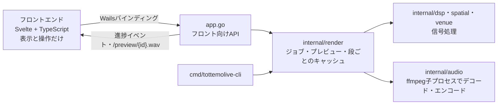

# TottemoLive 開発者向けガイド

TottemoLiveのビルド・テスト・CI/CD・リリースの手順と、コードの構成をまとめます。
アプリの紹介と使い方は[README](../README.md)、配布物の導入は[インストール手順](INSTALL.md)を参照してください。

| ドキュメント | 内容 |
| --- | --- |
| [設計書（TottemoLive-design.md）](../TottemoLive-design.md) | 信号処理・プレビュー・キャッシュ・Wails連携・データモデルの設計。仕様の正はこちら |
| [CLAUDE.md](../CLAUDE.md) | 開発規約（レイヤの境界、パラメーターの足し方、git運用など） |
| [インストール手順（docs/INSTALL.md）](INSTALL.md) | 配布物の導入、FFmpeg／Demucsの設定、ディスクキャッシュ |

## 開発環境

| ツール | バージョン・備考 |
| --- | --- |
| Go | `go.mod`の`go`ディレクティブに従う |
| Node.js | 24（フロントエンドのビルド。`wails dev`／`wails build`も内部で使う） |
| Wails CLI | `go.mod`の依存と同じバージョン（現在はv2.16.0） |
| Python | 3.13（配布ZIPの作成・バージョン設定のスクリプトとそのテスト） |
| FFmpeg／ffprobe | 実行時とテストに必要。PATH上に置くか、環境変数で指定する |
| Demucs | 任意。ステム分離を試すときだけ |

GUIビルドには[Wailsの環境構築](https://wails.io/docs/gettingstarted/installation/)とOS別の開発ツールが必要です。
MacはXcode Command Line Toolsが必要です。
LinuxはGTK 3とWebKitGTK 4.1を使い、Goのテスト・vetとWailsビルドに`webkit2_41`タグを付けます（CIと同じ）。

```sh
go install github.com/wailsapp/wails/v2/cmd/wails@v2.16.0
cd frontend
npm ci
cd ..
```

### 環境変数

| 変数 | 用途 |
| --- | --- |
| `TOTTEMOLIVE_FFMPEG` / `TOTTEMOLIVE_FFPROBE` | ffmpeg／ffprobeの実行ファイルの場所（PATHにないとき） |
| `TOTTEMOLIVE_DEMUCS` | demucsの実行ファイルの場所（PATHにないとき） |
| `TOTTEMOLIVE_CACHE_DIR` | CLIの一時ファイルの置き場所（絶対パス） |
| `TOTTEMOLIVE_CACHE=off` | CLIでキャッシュを使わない（`render`は元々使わない） |

GUIのキャッシュの設定は、アプリの設定ダイアログで変えます（[インストール手順のディスクキャッシュの節](INSTALL.md#ディスクキャッシュ一時ファイル)）。

## よく使うコマンド

### 開発起動

```sh
wails dev
```

ネイティブのウィンドウが開きます。ブラウザから http://localhost:34115 を開いても操作できます（Goのメソッドはバインディング経由で呼ばれます）。
Node.jsが必要です。

### テスト・チェック

```sh
go test ./internal/...                 # DSPエンジンのテスト（ffmpegがなければrenderのE2Eはスキップ）
go test ./internal/dsp -run TestXxx    # 単一テスト
go test ./... -count=1                 # すべてのGoのテスト（CIと同じ範囲）
go vet ./...
cd frontend && npx svelte-check        # フロントの型チェック（npm run check と同じ）
cd frontend && npm test                # フロントの純粋な計算（スペクトラムの帯域・補正など）のテスト（node:test）
python3 -m unittest discover -s scripts -p 'test_*.py' -v   # 配布スクリプトのテスト
```

Windowsでは、Pythonのコマンドを`python`で実行できます。

### CLI（Wailsなし）

GUIと同じエンジンを、コマンドラインから呼べます。動作確認・テスト・一括変換用です。

```sh
go run ./cmd/tottemolive-cli new -o project.json a.wav b.wav                      # 既定値のプロジェクトを作る
go run ./cmd/tottemolive-cli render project.json -o out.wav --set pa.lowCutHz=80  # 書き出し。--venue ID で会場を切り替え
go run ./cmd/tottemolive-cli params                                               # 音作りパラメーターの一覧
```

`--set`のパスは、プロジェクトJSONのパス・音作りパラメーターの`Path`と同じです。
音質の追い込みはGUIの音作りパネルとプレビューで行い、CLIでは処理の正しさを確かめます。

### 配布ビルド

```sh
wails build -clean -m -nosyncgomod
```

生成物は`build/bin`に出力されます（Windowsは`build/bin/TottemoLive.exe`）。
MacのIntel／Apple Siliconを明示する場合は`-platform darwin/amd64`または`-platform darwin/arm64`、Windows x64は`-platform windows/amd64`を指定します。

配布ZIPの作成例（Apple Silicon Mac）：

```sh
python3 scripts/package.py --target macos-arm64
```

`--target`にはwindows-amd64、macos-amd64、macos-arm64を指定できます。
ZIPには実行ファイルと`docs/INSTALL.md`（`INSTALL.md`として）が入ります。
MacのZIP作成はdittoを使うためMac上で実行してください。
ZIPと.zip.sha256は`dist`に出力されます。

## アーキテクチャの概要

詳細は[設計書](../TottemoLive-design.md)にあります。ここでは全体像だけを示します。



- Wailsに依存してよいのは`main.go`と`app.go`だけです。`internal/`以下はWailsをimportしないので、同じエンジンをCLIから呼べます
- デコードから書き出しまで、処理はすべてGo側の`internal/render`のジョブが実行します。フロントは表示と操作だけです
- cgoとPythonをGoのビルドに持ち込みません。FFmpegとDemucsは子プロセスで呼び、起動は必ず`internal/procutil.HideConsole`を通します（GUIのリリースビルドでコンソール窓が出ないように。あわせて`WaitDelay`も設定し、ChocolateyやScoopのshim経由のffmpegを止めたときに`Wait`が固まらないようにしています）
- 音作りパラメーターは`internal/params`の`ParamSpec`の表が正です。音作りパネルは`ListParams()`から自動生成されるので、パラメーターを足すときはProjectの構造体と表に1行足すだけで、フロントのコードは変えません
- プレビューは書き出しと同じ処理を曲全体に対して行います（軽量版の経路は作らない）。例外は先行プレビュー（再生位置の周辺約30秒を同じ処理で先に作る）だけです
- プレビューの各段（PA・直接音・残響）の出力はディスクのスプールにキャッシュし、キャッシュキーは「その段が読むパラメーターの値 + 上流の段のキー」です。段が読むパラメーターを増やしたら、キーにも含めます
- TypeScriptの型はWailsのバインディング生成に任せます（Goの構造体が正）。`frontend/wailsjs`は生成物ですがコミットします。Goの公開メソッドや構造体を変えたら`wails generate module`で再生成します（`wails dev`／`wails build`でも自動）

決まりの一覧は[CLAUDE.md](../CLAUDE.md)の「アーキテクチャ上の決まり」節にあります。

## ディレクトリ構成

```
TottemoLive/
├── main.go / app.go         Wails起動とフロントに公開するApp（Wailsに依存するのはこの2つだけ）
├── cmd/tottemolive-cli/     CLI（Wailsなし）
├── internal/
│   ├── analysis/            PA出力の帯域レベル（スペクトラムの重ね表示用）
│   ├── audio/               デコード・エンコード（ffmpeg／ffprobe子プロセス）
│   ├── dsp/                 FFT畳み込み、Biquad、コンプ、リミッタ、ラウドネス
│   ├── params/              音作りパラメーターの定義表、Pathでの読み書き、範囲への丸め
│   ├── procutil/            子プロセスのコンソール窓を隠す
│   ├── project/             プロジェクトファイルと音作りプリセットの読み書き
│   ├── render/              処理の組み立て、ジョブ、プレビュー、段ごとのキャッシュ
│   ├── separate/            Demucsによるステム分離（任意、子プロセス）
│   ├── settings/            アプリの設定（キャッシュの使用・置き場所）
│   ├── spatial/             HRIR（現状は合成）、仮想スピーカー、距離・空気吸収
│   └── venue/               会場プリセット、会場IR（現状は合成）
├── assets/                  同梱アセット（出荷時の音作りプリセットなど）
├── frontend/                Svelte + TypeScript（src/lib に各パネル、wailsjs は生成物）
├── build/                   Wailsのビルド設定・アイコン
├── scripts/                 配布ZIPの作成、リリース時のバージョン設定とそのテスト
├── docs/                    インストール手順、このガイド、画像
└── .github/workflows/       CI・リリース用ワークフロー
```

## テスト方針

- **流し処理と全体処理の一致**：チャンクごとに流す処理器（畳み込み・コンプ・リミッタ・ラウドネスメーターなど）は、曲全体を一度に処理した結果とビット単位で一致することを確かめます。全体処理の写しはテスト内（`reference_test.go`・`legacy_test.go`）にだけ置きます
- **並列化の結果**：並列処理の結果が並列度・区切り方に依らず一致することをテストし、CIでは`internal/dsp`と`internal/render`を`-race -short`でも実行します
- **キャッシュの無効化**：どのパラメーターがどの段のキャッシュを無効にするかを`internal/render/preview_test.go`で固定しています。段が読むパラメーターを変えたら、ここも更新します
- **先行プレビュー**：窓の結果が曲全体の同じ範囲と一致すること、ラウドネスの推定誤差が収まることをテストしています
- **外部プロセス**：FFmpegがない環境では、renderのE2Eテストをスキップします。Demucsは本物を使わず、偽のdemucs（`internal/separate/testdata`）でテストします。GUIのリリースビルドで子プロセスのコンソール窓が出ないことは、Windowsで手動の確認用プログラム`internal/procutil/testdata/windowcheck`（使い方はその`main.go`の冒頭）を使って確かめます
- **フロントエンド**：画面のテストはなく、純粋な計算（スペクトラムの帯域・補正、表示の書式など）だけを`node:test`でテストします

## CI/CD

| ワークフロー | 自動実行 | 手動実行 | 成果物 |
| --- | --- | --- | --- |
| CI（ci.yml） | main／devへのpushとPR | workflow_dispatch | Ubuntuで検証・ビルド。Linux検証用tar.gzとSHA-256 |
| Release Build（release.yml） | GitHub Releasesの公開 | workflow_dispatch | Ubuntuで検証後、Windows／Macの配布ZIPとSHA-256。公開イベントではRelease Assetsへ添付 |
| Release desktop build（build.yml） | リリース用ワークフローから呼び出す | 直接実行せずRelease Buildを使用 | Windows／Macの検証・ビルド・ZIP作成 |

通常CIはubuntu-24.04だけで実行します。
Windows x64、Mac Intel、Mac Apple Siliconのネイティブビルドは、Releasesの公開または手動で起動するリリース用ワークフローに限定します。
リリース用ワークフローも最初にUbuntuのCIを実行し、その成功後に各OSのビルドを開始します。
型チェック、フロントエンドのテスト、Goのテストとvet、配布スクリプトのテストに成功した成果物を保存します。
CIにもFFmpeg／ffprobeを導入するため、音声処理のテストを実行できます。
成果物にはFFmpegを同梱しません。

### 手動でCI／ビルドを実行する

ワークフローをGitHubの既定ブランチ（main）に取り込んだ後、次の操作で実行できます。
workflow_dispatchは、ワークフローファイルが既定ブランチに存在する必要があります。

1. GitHubの「Actions」を開きます。
2. 「CI」または「Release Build」を選びます。
3. 「Run workflow」で対象ブランチ／タグを選び、実行します。
4. 成功した実行の「Artifacts」から成果物をダウンロードします。
5. Release Buildの成果物は、artifactのZIPを展開し、中の対象OSの配布ZIPとチェックサムを取り出します。

CIの成果物はTottemoLive-ci-linux-amd64です。Ubuntuでのビルド検証用tar.gzで、Windows／Mac向けの配布物ではありません。

リリースの作成・公開はユーザーが行います。公開イベントでは、ビルド成功後にZIPとSHA256SUMSをそのリリースのAssetsへ自動添付します。
手動実行はActionsのArtifactsへの保存までで、Release Assetsには添付しません。
vMAJOR.MINOR.PATCH形式のタグからビルドした場合は、そのタグをアプリの製品バージョンに使用します（`scripts/set-version.py`が`wails.json`に設定）。
ブランチからの手動ビルドでは、選択したリビジョンの`wails.json`の値を使用します。
成果物の保持期間は14日です。

### 初回リリース前の確認

mainへの取り込み後、最初の実リリースを公開する前に、Release Buildをworkflow_dispatchで一度実行してください。
Windows x64・Intel Mac・Apple Silicon Macの全ビルドと、チェックサム作成まで成功したことを確認します。
失敗した場合はWindowsのFFmpeg導入、Macランナーの選択、Wailsのビルド手順のログを確認し、修正後に再実行してください。
この手動確認ではGitHub Releasesの作成・公開・編集は行いません。

### リリースの手順

1. 公開対象のコミットに、v1.2.3のような`vMAJOR.MINOR.PATCH`形式のタグを付けます。
   タグはGitHubのReleases画面で作成しても、ローカルで作成してpushしても構いません。
   先頭ゼロ、プレリリースやビルドメタデータ付きのタグには対応していません。
2. GitHubのReleases画面でタグを選び、リリースノートを入力して、ご自身で公開します。
3. 公開イベント（release: published）でRelease Buildが開始します。
4. 全対象のビルドとチェックサム検証が成功すると、3つの配布ZIPとSHA256SUMSが、そのリリースのAssetsに自動添付されます。
5. 利用者はリリースページのAssetsから対象OSのZIPを直接ダウンロードできます。

CIはビルド・Actionsへの成果物保存・公開済みリリースへのファイル添付を担当します。リリースの作成、公開状態やリリースノートの変更は行いません。
ビルド・添付完了まではAssetsに配布ZIPが揃っていないため、Release Buildの成功を確認してください。
同名のAssetsがすでにある場合は上書きせず失敗します。再実行する場合は、対象ファイルを確認して必要なAssetsを手動で削除してから、添付ジョブを再実行してください。
タグのpushだけではRelease Buildは起動しません。draftの保存も対象外で、公開時に起動します。
ビルドが失敗しても、すでに公開したリリースの状態は変更しません。
ビルド・検証はcontents: read、Assetsへの添付ジョブだけcontents: writeを使用します。

Windowsのコード署名、AppleのDeveloper ID署名・公証、自動更新は含みません。

## git運用

- 基本的にはgitflowに沿います。作業は`dev`からブランチを切り、`dev`へPRでマージします
- コミットメッセージは日本語で書きます
- `dev`にマージする際はPRを立て、自己レビューします

設計と違う実装をする場合は、[設計書](../TottemoLive-design.md)も同じ変更で更新します。
