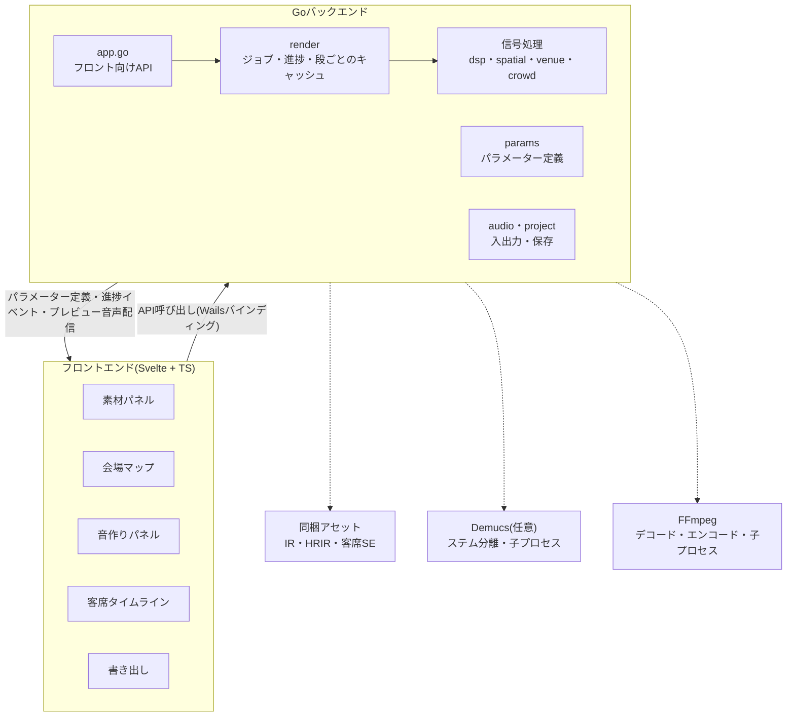
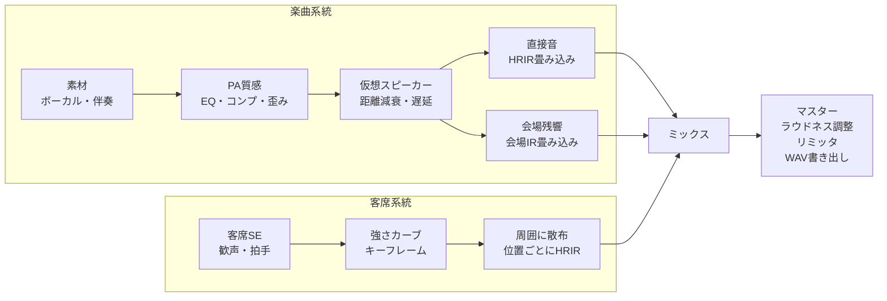

# ライブ風バイノーラル変換ツール 設計書(Go + Wails)

2026-10-02

## 概要とゴール

楽曲音源を読み込み、指定した会場と座席で聴いているようなバイノーラル音源を書き出すデスクトップアプリ。信号処理と書き出しはGoで行い、UIはWails上のフロントエンド(Svelte + TypeScript想定)で組む。

- 入力: WAV / FLAC / MP3。ボーカルと伴奏のステム推奨、2mixのみも可
- 処理: PA質感付け → 仮想スピーカー配置 → 会場残響 → 客席ノイズ → バイノーラル化
- 音作り: 上記の各段のパラメーターをすべてUIから調整でき、曲全体のプレビューで聴きながら詰められる
- 出力: 48kHz / 24bit ステレオWAV(ヘッドホン再生前提)
- 初版の対象外: リアルタイム処理、ヘッドトラッキング、動画との合成

## 全体アーキテクチャ

フロントは表示と操作だけを担当し、デコードから書き出しまでの処理はすべてGo側のrenderジョブが実行する。音作りパラメーターの定義(範囲・既定値・表示名)もGo側が持ち、フロントはその定義から調整UIを自動生成する。



FFmpegとDemucsは子プロセスとして呼ぶので、GoのビルドにcgoやPythonを持ち込まずに済む。

## 信号処理パイプライン

楽曲は「PA → 仮想スピーカー → 直接音と残響」、客席SEは「強さカーブ → 周囲に散布」の2系統で処理し、最後に1本にまとめる。



- PA質感: 低域カット、高域を少し丸めるシェルフ、軽いコンプと歪みで「スピーカー越し」の音にする
- 仮想スピーカー: 左右のメインPAを置き、リスナーまでの距離から遅延・減衰・高域の空気吸収を計算する。左スピーカーに左ch、右スピーカーに右chを入力する。距離減衰は基準距離10 m(これより近くは減衰しない)で、上限+12 dBまで。残響は距離減衰前のPA出力(モノラル和)で駆動する(拡散音場のレベルは距離に依らないため)
- 直接音: スピーカーごとに方向に合うHRIRを畳み込む
- 会場残響: 会場IRにプリディレイ・減衰の伸縮・高域ダンプを掛けてから畳み込む
- 客席SE: 複数の素材をリスナー周囲のランダムな位置に置き、キーフレームの強さで音量を動かす
- ミックス: 直接音・残響・客席の3本をそれぞれのレベルで足す。直接音は `directLevelDb` に `(1 - reverb.mix)` を、残響は `reverb.mix` を掛け、客席は `crowd.levelDb` を掛ける
- マスター: ラウドネスを目標値に合わせ、トゥルーピークリミッタで仕上げる

各段が読むパラメーターは「音作りパラメーター」節の表にまとめる。

## 音作りパラメーター

音に関わる数値はコードに固定値で埋めず、すべてパラメーターとして定義し、UIから調整できるようにする。

### パラメーター定義(`internal/params`)

パラメーターの一覧を`internal/params`に1つの表として持つ。これがUI・CLI・値の検証・既定値の共通の元になる。

```go
type ParamSpec struct {
    Path     string   // Project内の位置。例 "pa.lowCutHz"
    Label    string   // UIの表示名
    Group    string   // pa / spatial / reverb / crowd / master
    Kind     string   // "float" / "int" / "enum"
    Unit     string   // "Hz" "dB" "ms" など
    Min, Max float64
    Step     float64
    Default  float64
    Scale    string   // "linear" / "log"(周波数や時間はlog)
    Options  []string // enumの選択肢
    Advanced bool     // trueなら「詳細」を開いたときだけ表示
}
```

- フロントは`ListParams()`で表を受け取り、スライダーや選択肢を自動生成する。パラメーターを足すときはGoの構造体にフィールドを足し、表に1行足すだけで、画面側のコードは変えない
- `Path`での値の読み書きは、Go側はjsonタグを使ったリフレクション、フロント側はパスを`.`で分割して行う
- `LoadProject`とレンダリング開始時に、Go側で全パラメーターを`Min`〜`Max`に丸める(プロジェクトファイルの手編集や古いプリセットへの備え)
- 表のすべての`Path`がProjectのフィールドに解決できることをテストで確認する

### パラメーター一覧

範囲と既定値は出発点で、M2で実際に聴きながら見直す。残響の既定値は会場プリセットごとに違う値を持つ。

| グループ | Path | 表示名 | 範囲 | 既定値 | 読む段 |
| --- | --- | --- | --- | --- | --- |
| PA質感 | `pa.lowCutHz` | 低域カット | 20〜200 Hz | 60 | PA |
| | `pa.highShelfHz` | 高域シェルフ周波数 | 2000〜12000 Hz | 6000 | PA |
| | `pa.highShelfDb` | 高域シェルフ量 | -12〜0 dB | -3 | PA |
| | `pa.compThresholdDb` | コンプ スレッショルド | -40〜0 dB | -18 | PA |
| | `pa.compRatio` | コンプ レシオ | 1〜10 | 3 | PA |
| | `pa.compAttackMs` | コンプ アタック(詳細) | 1〜100 ms | 10 | PA |
| | `pa.compReleaseMs` | コンプ リリース(詳細) | 20〜1000 ms | 150 | PA |
| | `pa.drive` | 歪み | 0〜1 | 0.2 | PA |
| 空間 | `spatial.hrirSet` | HRIRの種類 | 同梱HRIRから選択 | synthetic | 直接音・客席 |
| | `spatial.distanceRolloff` | 距離減衰の強さ | 0〜1.5(1で逆距離則) | 1.0 | 仮想スピーカー |
| | `spatial.airAbsorption` | 空気吸収の強さ | 0〜2(1で物理値) | 1.0 | 仮想スピーカー |
| | `spatial.directLevelDb` | 直接音レベル | -12〜+6 dB | 0 | ミックス |
| 残響 | `reverb.mix` | 残響量 | 0〜1 | 0.35 | ミックス |
| | `reverb.preDelayMs` | プリディレイ | 0〜150 ms | 会場ごと | 会場残響 |
| | `reverb.decayScale` | 残響の長さ | 0.5〜1.2倍 | 1.0 | 会場残響 |
| | `reverb.highDampHz` | 残響の高域ダンプ | 2000〜16000 Hz | 会場ごと | 会場残響 |
| 客席 | `crowd.density` | 客席の密度 | 0〜1 | 0.7 | 客席 |
| | `crowd.levelDb` | 客席レベル | -30〜+6 dB | -6 | ミックス |
| | `crowd.spreadM` | 散布半径 | 2〜30 m | 10 | 客席 |
| | `crowd.seed` | 配置の乱数シード | 整数 | 1 | 客席 |
| マスター | `output.targetLufs` | ラウドネス目標 | -24〜-9 LUFS | -14 | マスター |
| | `output.ceilingDbTp` | ピーク上限 | -3〜0 dBTP | -1 | マスター |

- `reverb.decayScale`は会場IRに指数エンベロープを掛けて実現する。伸ばす側はIR末尾のノイズも持ち上がるので上限を1.2倍に抑える
- `crowd.seed`はスライダーではなく「配置を引き直す」ボタンで変える
- リスナー位置とスピーカー位置は会場マップ、歓声キーフレームと手拍子区間は客席タイムラインで編集する(上の表には含めない)

### 会場プリセットと音作りプリセット

- 会場プリセット: 会場IR、部屋の寸法、スピーカーの既定位置、残響パラメーターの既定値を持つ。会場を切り替えると`venue.speakers`と`reverb.*`をプリセットの値で上書きし、リスナー位置を部屋の範囲内に収める
- 音作りプリセット: `pa` `spatial` `reverb` `output`の全パラメーターと、`crowd`のうち表にある4つを名前を付けて保存したもの。素材・座席・タイムラインは含めないので、別の曲にそのまま適用できる
- 音作りプリセットの保存先は`os.UserConfigDir()`以下の`livebin/presets/*.json`。出荷時のプリセットは`assets/presets/`に同梱し、読み取り専用として一覧の先頭に混ぜる。出荷時と同名のユーザープリセットは作れない。読み込み時は欠けた項目を既定値で補い、範囲に丸める

### 聴きながら調整するためのプレビュー

リアルタイム処理は初版の対象外のままとし、「値を変える → 曲全体を作り直す → 再生位置を保ったまま差し替わる」を短い待ち時間で回す。

- プレビューは曲全体を、書き出しと同じ処理で作る(区間だけの再生はしない)。品質を落とした軽量版は作らない。音量も曲全体で測るので、プレビューと書き出しは同じ音・同じラウドネスになる
- 段ごとのキャッシュ: renderはプレビューの各段の出力をメモリに保持する。各段は「自分が読むパラメーターの値」と「上流の段のキー」からキャッシュキーを作り、キーが変わった段から下流だけを計算し直す。たとえば`reverb.mix`を動かしたときはミックスとマスターだけ、`pa.*`を動かしたときは楽曲系統の全段をやり直す(客席系統は再利用)
- 各段の出力の長さは、残響パラメーターを範囲の上限まで振っても会場IRが収まる長さで固定し、ミックスの前に実際の長さへ切り詰める(IRの長さがキーに入ると、残響を動かしたとき直接音・客席まで再計算になるため)。4分の曲での目安は、初回約6.5秒、`reverb.mix` など読む段が後ろの項目で約0.7秒、`pa.*` で約8秒
- キャッシュは段(スロット)ごとに最新の1件だけ保持する。段は decode:音源 / pa:音源 / direct / reverb / crowd で、ミックスとマスターは毎回計算する。各段が読むパラメーターは`internal/render/render.go`の各段の関数に書いてあり、テスト(`preview_test.go`)で「どのパラメーターがどの段を無効にするか」を固定している
- 新しいプレビューが届いたら、フロントは再生位置を保ったまま音源を差し替える
- 古いパラメーターでのレンダリングが進行中に次の変更が来たら、進行中のジョブをキャンセルして最新の値でやり直す

## Goバックエンド パッケージ構成

DSPは`internal/`以下に役割ごとに分け、Wailsに依存するのは`main.go`と`app.go`だけにする。こうしておけば同じエンジンをCLIからも呼べる。

```
livebin/
├── main.go          // Wails起動、AssetServerハンドラ登録
├── app.go           // フロントに公開するApp構造体
├── cmd/livebin-cli/ // CLI(Wailsなし)。動作確認・テスト・一括変換用
├── internal/
│   ├── audio/       // デコード・エンコード(ffmpeg子プロセス)、リサンプル
│   ├── dsp/         // 分割FFT畳み込み、Biquad、コンプ、リミッタ
│   ├── spatial/     // HRIR読み込み、仮想音源、距離モデル
│   ├── venue/       // 会場プリセット、IR管理
│   ├── crowd/       // 客席SEのスケジューラ
│   ├── params/      // パラメーター定義の表、Pathでの読み書き、範囲への丸め
│   ├── render/      // 処理グラフ組み立て、ジョブ実行、段ごとのキャッシュ、進捗通知
│   ├── project/     // プロジェクトファイルと音作りプリセットの読み書き
│   └── separate/    // ステム分離(任意、外部プロセス)
├── assets/          // 同梱IR・HRIR・客席SE・出荷時プリセット
└── frontend/        // Svelte + TS
```

実装上の要点:

- 内部表現はfloat32のチャンネル別バッファ。ブロックサイズ1024で処理する
- 会場IRは数秒あるため、直接畳み込みではなく一様分割FFT畳み込み(overlap-save)を使う。FFTは`gonum.org/v1/gonum/dsp/fourier`
- デコードはffmpegを子プロセスで呼び、生PCMをパイプで受ける。形式ごとの純Goデコーダの差を吸収するため
- 音源ごとの処理はgoroutineで並列に回す。ただしPAより後ろの段(距離・遅延・フィルタ・畳み込み)は線形なので、非線形なPA質感(コンプ・歪み)まで音源ごとに処理して合流し、以降は合流後のバスを処理する(音源ごとに処理して足すのと結果は同じで、会場IRの畳み込みが音源数倍にならない)。直接音(スピーカーごと)・残響(左右)・客席はそれぞれ並列
- ジョブは`context.Context`でキャンセル可能にする
- DSPの各段は音に関わる数値をProjectのパラメーターから受け取る。コード内に定数として埋めない
- CLIも同じパラメーター定義を使う。`livebin-cli render project.json -o out.wav --set pa.lowCutHz=80`のようにPathで上書きでき、`livebin-cli params`で一覧を出す

## Wails連携(バインディング・イベント・プレビュー)

重い処理はすべてGo側に置き、フロントにはメソッド呼び出し・進捗イベント・プレビュー音声のURLだけを渡す。Wails v2(安定版)を前提にし、着手時点でv3が正式版になっていれば移行を検討する。

**App構造体のバインディング**

| メソッド | 役割 |
| --- | --- |
| `OpenAudioFiles() ([]SourceInfo, error)` | ネイティブのファイル選択、長さ・サンプルレート取得 |
| `AddAudioFiles(paths []string) ([]SourceInfo, error)` | パス指定で取り込む(ドラッグ&ドロップ用)。読めないファイルがあっても他は取り込み、エラーにまとめて返す |
| `ChooseProjectToOpen()` / `ChooseProjectSavePath()` / `ChooseExportPath() (string, error)` | ネイティブのファイル選択・保存ダイアログ。キャンセルは空文字 |
| `GetPeaks(sourceID string, width int) ([]float32, error)` | 波形表示用のmin/maxピーク列 |
| `NewProject() Project` | 全パラメーターが既定値のプロジェクトを返す |
| `LoadProject(path string) (Project, error)` / `SaveProject(path string, p Project) error` | プロジェクトの読み書き |
| `ListParams() []ParamSpec` | 音作りパラメーターの定義一覧。音作りパネルはこれから生成する |
| `ListVenues() []VenuePreset` | 会場プリセット一覧 |
| `ApplyVenue(p Project, presetID string) (Project, error)` | 会場を切り替え、スピーカー位置と残響の既定値を反映したProjectを返す |
| `ListSoundPresets() []SoundPresetInfo` | 音作りプリセット一覧(出荷時 + ユーザー保存) |
| `ApplySoundPreset(p Project, name string) (Project, error)` | プリセットの値を反映したProjectを返す |
| `SaveSoundPreset(name string, p Project) error` / `DeleteSoundPreset(name string) error` | ユーザープリセットの保存と削除 |
| `RenderPreview(p Project) (string, error)` | 曲全体を書き出しと同じ処理でレンダリングし、プレビューURLを返す。段ごとのキャッシュを使う。新しい要求が来ると進行中のプレビューは中断され、中断された呼び出しは空文字とnilを返す(フロントは無視する) |
| `RenderOriginal(p Project) (string, error)` | 曲全体の原音(ゲインを掛けて足しただけ)のURL。A/B比較用で、ラウドネスはマスターを通して目標にそろえる |
| `StartExport(p Project, outPath string) (string, error)` | 書き出しジョブを開始し、ジョブIDを返す |
| `CancelJob(jobID string)` | ジョブの中断(書き出し・ステム分離) |
| `StemSeparationAvailable() bool` | Demucsが使えるか。使えないときフロントは分離ボタンを隠す |
| `SeparateSource(sourceID string) (string, error)` | 音源をボーカルと伴奏に分離するジョブを開始し、ジョブIDを返す。同じ音源の結果はキャッシュ(`os.UserCacheDir()/livebin/stems`)される |

**イベント(`runtime.EventsEmit`)**

- `render:progress` … `{jobId, stage, ratio}`。stageは decode / process / encode
- `render:done` … `{jobId, path}`
- `render:error` … `{jobId, message}`(中断もこのイベント)
- `separate:progress` … `{jobId, sourceId, ratio}`、`separate:done` … `{jobId, sourceId, vocals, backing}`(分離した2本は取り込み済みの `SourceInfo`)、`separate:error` … `{jobId, sourceId, message}`

**プレビュー音声の受け渡し**

- 生PCMをバインディングで返すとJSONが巨大になるので使わない
- Go側でレンダリングしたWAV(16bit、ディザ付き。再生専用)をメモリに保持し、AssetServerの`Handler`で`/preview/{id}.wav`として配信する。保持は最新3件(現在のプレビュー・原音・次のプレビュー)
- フロントは`<audio>`で再生する。Rangeリクエストに対応させてシークできるようにする。ただしWebViewのRange対応に依存しないよう、フロントは一度`fetch`してblob URLにして再生する
- 開発時(`wails dev`)はViteのindex.htmlフォールバックに取られないよう、`vite.config.ts`のプラグインで`/preview/`を404にしてGo側のハンドラへ回す
- 波形もピーク列だけを返し、描画はフロントのcanvasで行う

## フロントエンドUI設計

1画面構成で、左に素材と会場、中央に会場マップ、右に音作りパネル、下に波形と客席タイムラインを置く。Projectはフロントのstoreで持ち、変更から200ms待って曲全体のプレビューを作り直す。

1. 素材パネル: ドラッグ&ドロップで投入。トラックごとに役割(ボーカル / 伴奏 / 2mix)とゲインを設定
2. 会場パネル: プリセット選択(クラブ / ライブハウス / ホール / アリーナ / 野外フェス / ドーム)
3. 会場マップ: 上から見た図にステージ・PAスピーカー・リスナーを表示。リスナー(座席)とスピーカーをドラッグで動かす
4. 音作りパネル: `ListParams()`の定義から自動生成する
   - グループ(PA質感 / 空間 / 残響 / 客席 / マスター)ごとに折りたたみ
   - 各パラメーターはスライダー + 数値入力 + 単位表示。`Scale`がlogのものは対数スライダー
   - 既定値から変えた項目には印を付け、ダブルクリックで既定値に戻す。グループ単位のリセットも置く
   - `Advanced`の項目は「詳細」を開いたときだけ表示
   - パネル上部に音作りプリセットの選択・保存・削除
5. 客席タイムライン: 波形の下に、同じ時間軸で歓声の強さのキーフレームを打つ(空いた所をクリックで追加、ドラッグで移動、ダブルクリックで削除)。手拍子区間はドラッグで作り、端や中身のドラッグで調整する。時間軸は曲の長さに会場の残響の尾を足したもので、曲の終わり後の歓声も置ける。「曲前後の歓声を配置」ボタンで、曲の始まりの歓声と終わり後の拍手を自動で置く。曲の頭より前に無音の導入を置くことは初版では対応しない(時刻は曲頭から0以上)。キーフレームは時刻順・強さ0〜1、手拍子区間は時刻順で重なりを結合するよう、Go側(`Project.Normalize`)でも整える
6. トランスポート: 曲全体の再生・停止・曲頭へ、波形のクリック/ドラッグで再生位置の移動、原音とのA/B切り替え。プレビュー作り直し中は再生を止めず、できあがったら同じ位置から差し替える。区間指定やループ再生はない
7. 書き出しダイアログ: 出力形式、進捗バー、中断ボタン

## データモデル(プロジェクトファイル)

プロジェクトは1つのJSONファイルに保存し、音源は絶対パスで参照する(コピーしない)。同じ構造体をGoとTSで共有し、TS側の型はWailsのバインディング生成に任せる。座標はステージ中央を原点としたメートル単位。音作りパラメーターは`pa` `spatial` `reverb` `crowd` `output`の各グループに置き、`ParamSpec.Path`がそのままJSONのパスになる。

```json
{
  "version": 1,
  "sources": [
    { "id": "vo", "path": "/path/vocal.wav", "role": "vocal", "gainDb": 0 },
    { "id": "inst", "path": "/path/inst.wav", "role": "backing", "gainDb": -1.5 }
  ],
  "venue": {
    "preset": "arena",
    "speakers": [
      { "id": "L", "x": -12, "y": 0, "z": 8 },
      { "id": "R", "x": 12, "y": 0, "z": 8 }
    ]
  },
  "listener": { "x": 0, "y": 25, "z": 1.2, "yawDeg": 0 },
  "pa": {
    "lowCutHz": 60,
    "highShelfHz": 6000,
    "highShelfDb": -3,
    "compThresholdDb": -18,
    "compRatio": 3,
    "compAttackMs": 10,
    "compReleaseMs": 150,
    "drive": 0.2
  },
  "spatial": {
    "hrirSet": "synthetic",
    "distanceRolloff": 1.0,
    "airAbsorption": 1.0,
    "directLevelDb": 0
  },
  "reverb": { "mix": 0.35, "preDelayMs": 40, "decayScale": 1.0, "highDampHz": 8000 },
  "crowd": {
    "density": 0.7,
    "levelDb": -6,
    "spreadM": 10,
    "seed": 1,
    "keyframes": [
      { "t": 0.0, "cheer": 0.9 },
      { "t": 6.0, "cheer": 0.1 }
    ],
    "clapRanges": [{ "start": 52.0, "end": 80.0 }]
  },
  "output": { "sampleRate": 48000, "bitDepth": 24, "targetLufs": -14, "ceilingDbTp": -1 }
}
```

音作りプリセットのファイルは、このうち`pa` `spatial` `reverb` `output`と、`crowd`の`density` `levelDb` `spreadM` `seed`だけを同じ形で持つ。

## M1時点の合成素材

実測のHRIR・会場IR・客席SEは再配布条件の確認が済むまで同梱しない。M1では次の合成で代用する。いずれも `spatial.LoadSet` / `venue.BuildIR` / `crowd` の内側だけの差し替えで実素材に置き換えられる。

- HRIR(`synthetic`): 球形頭部モデル。両耳間時間差はWoodworthの式、頭部の影は耳との位置関係で変わる低域通過(18 kHz〜2 kHz)と±3 dBのレベル差。耳介の効果は持たないので上下・前後の定位は弱い
- 会場IR: プリセットの残響時間(RT60)から作る指数減衰の無相関ノイズ(左右別)。`decayScale` はRT60の倍率、`highDampHz` は低域通過、IRの左右合計エネルギーは常に1にそろえる。早期反射は持たない
- 客席SE: 乱数シードから合成。歓声は帯域制限ノイズをゆっくり揺れる振幅で変調したもの(強さカーブを掛ける)、手拍子は短い減衰ノイズのバースト(`clapRanges` の区間のみ。平均間隔0.5秒、人ごとに位相とばらつきを変える)。`density=1` で12人(12音源)を散布する

## 外部依存・素材とライセンス

Go本体の依存はWailsとgonumに絞り、重いものは子プロセスとデータファイルとして外に置く。素材はそれぞれライセンスが違うので、同梱前に個別に確認する。

| 項目 | 候補 | 注意点 |
| --- | --- | --- |
| デスクトップ枠 | Wails | ビルドにNode.jsが必要 |
| FFT | gonum `dsp/fourier` | 純Go、cgo不要 |
| デコード / エンコード | FFmpeg(子プロセス) | 同梱するならLGPLビルドとライセンス表記 |
| HRIR | MIT KEMAR、SADIE IIなど | SOFA形式はHDF5でGoから読みにくい。事前にPythonでWAV + JSONへ変換して同梱 |
| 会場IR | OpenAIRなど | IRごとにライセンス条件が異なる |
| 客席SE | フリー素材、自前収録 | 再配布の可否を確認 |
| ステム分離 | Demucs(Python、子プロセス) | 重くGPU推奨。初版では任意機能。`demucs --two-stems=vocals -n htdemucs -o <出力先> <音源>` を呼び、`vocals.wav` と `no_vocals.wav` を伴奏と合わせて使う。進捗は標準エラーの `NN%|` 表示から読む |

変換した音源を公開する場合は、原曲側の利用条件に従う。piaproで配布されているインストも、その配布条件の範囲で使う。

## マイルストーン

音作りはUI上で行う。音作りパネルはパラメーター定義から自動生成するので、パラメーターを足したり範囲を変えたりしても画面側のコードは変わらない。そのためM1ではエンジンを通すところまでにとどめ、音質はM2で音作りパネルとプレビューがそろってから詰める。

1. M1 エンジンとCLI: 既定値で「ステム → PA → HRIR → 会場IR → 書き出し」を通す。`internal/params`の表と、全パラメーターをProjectから受け取る形をここで作る。確認するのは処理の正しさまで
2. M2 Wails骨格と音作りパネル: ファイル投入、会場プリセット選択、音作りパネル、曲全体のプレビュー(段ごとのキャッシュ)、原音とのA/B、書き出し、進捗表示。ここで音質を詰め、パラメーターの範囲と既定値を見直す
3. M3 会場マップ: 座席とスピーカーのドラッグ
4. M4 客席タイムライン: 歓声キーフレーム、手拍子区間
5. M5 ステム分離連携、音作りプリセットと会場プリセットの追加
